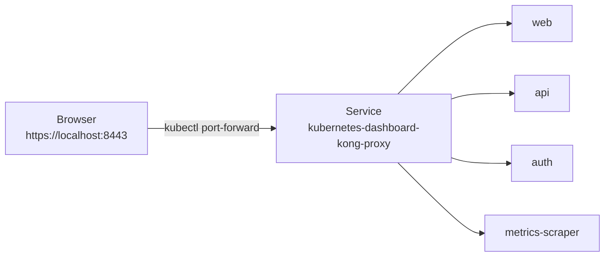
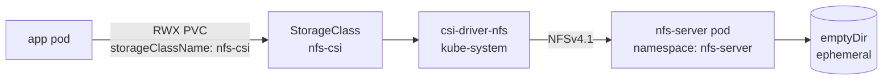
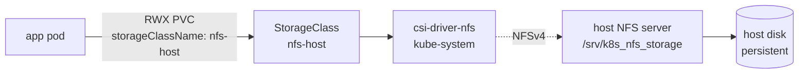
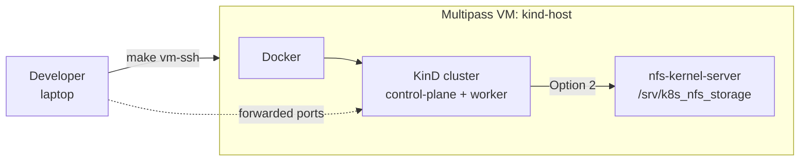

[](https://github.com/AndriyKalashnykov/kind-cluster/actions/workflows/ci.yml)
[](https://hits.sh/github.com/AndriyKalashnykov/kind-cluster/)
[](https://opensource.org/licenses/MIT)
[](https://app.renovatebot.com/dashboard#github/AndriyKalashnykov/kind-cluster)

# kind-cluster

Local Kubernetes lab on Docker via [KinD](https://kind.sigs.k8s.io/) — ingress, MetalLB, Dashboard, RWX NFS storage, and Prometheus wired up out of the box. Run on your host, or inside a throwaway Multipass VM.


| Component | Technology | Rationale |
|-----------|-----------|-----------|
| Cluster | [KinD](https://kind.sigs.k8s.io/) v0.31.0 on Docker | Fastest local k8s — single binary, multi-node config, no VM overhead |
| Ingress | [ingress-nginx](https://kubernetes.github.io/ingress-nginx/) | Reference controller; matches what most cloud-managed clusters expose |
| Load Balancer | [MetalLB](https://metallb.universe.tf/) | Gives KinD `Service: LoadBalancer` real IPs on the docker bridge — no `kubectl port-forward` per service |
| Storage (RWX) | [csi-driver-nfs](https://github.com/kubernetes-csi/csi-driver-nfs) v4.13.1 | Same driver backs both in-cluster and host-NFS modes — only the StorageClass differs |
| Observability | [kube-prometheus-stack](https://github.com/prometheus-community/helm-charts) | One-shot Prometheus + Grafana + Alertmanager + node-exporter for HPA / dashboards |
| Dashboard | [Kubernetes Dashboard](https://github.com/kubernetes/dashboard) v7.x | Helm chart v7 ships Kong-fronted dashboard with admin token in repo root |
| CI | GitHub Actions | `make deps` + `make create-cluster` — same Makefile path users hit locally; CI verifies install scripts on every push |

## Architecture


Source: [`docs/diagrams/c4-container.puml`](./docs/diagrams/c4-container.puml). Render with `make diagrams` (uses pinned `plantuml/plantuml` Docker image).

The cluster runs entirely on the local Docker bridge. MetalLB hands out LoadBalancer IPs from the bridge's IPv4 subnet so demo apps are reachable directly via `curl <LB_IP>:<port>` from the host. Ingress is bound to the control-plane node and patched to type `LoadBalancer` so `http://demo.localdev.me/` works without `kubectl port-forward`. The dashboard's Kong proxy listens on port 8443 inside the cluster — reach it via the `dashboard-forward` target.

## Quick Start

```bash
make deps        # verify required tools are installed
make kind-up     # create cluster + Nginx ingress + MetalLB + demo workloads
kubectl cluster-info --context kind-kind
echo "127.0.0.1 demo.localdev.me" | sudo tee -a /etc/hosts   # one-time
# Open http://demo.localdev.me/
make kind-down   # tear down
```

`kind-up` is a docker-compose-style alias for `install-all`. For the cluster and add-ons without the demo apps, run `make install-all-no-demo-workloads`.

Once the stack is up, see [**Access services**](#access-services) for discovering LoadBalancer IPs and opening service URLs — the same section covers both bare-host (`make kind-up`) and VM (`make vm-install-all`) paths.

## Prerequisites

| Tool | Version | Purpose |
|------|---------|---------|
| [GNU Make](https://www.gnu.org/software/make/) | 3.81+ | Task orchestration |
| [Git](https://git-scm.com/) | latest | Version control |
| [Docker](https://www.docker.com/) | latest | Container runtime for KinD nodes |
| [kind](https://kind.sigs.k8s.io/docs/user/quick-start#installation) | v0.31.0+ | Local Kubernetes in Docker |
| [kubectl](https://kubernetes.io/docs/tasks/tools/) | v1.35.1+ | Kubernetes CLI |
| [helm](https://helm.sh/docs/intro/install/) | v3+ | Chart-based installs (dashboard, Prometheus, NFS) |
| [curl](https://curl.se/) | latest | Download helpers used by scripts |
| [jq](https://github.com/jqlang/jq) | latest | JSON parsing in scripts |
| [base64](https://command-not-found.com/base64) | latest | Token decoding for dashboard access |

## Kubernetes Dashboard install

Pinned to Helm chart [`kubernetes-dashboard`](https://github.com/kubernetes/dashboard) **v7.14.0**. Dashboard v7 splits the monolithic v2 service into microservices (`api`, `web`, `auth`, `metrics-scraper`) behind a **Kong Gateway** reverse proxy — you port-forward the `kong-proxy` Service, not a pod.



```bash
make dashboard-install   # helm upgrade --install + apply admin ServiceAccount + write token to dashboard-admin-token.txt
make dashboard-forward   # kubectl port-forward svc/kubernetes-dashboard-kong-proxy 8443:443 + xdg-open
make dashboard-token     # print the admin-user token
```

At the login screen, select **Token** and paste the token printed by `make dashboard-token`. See [Access services · Kubernetes Dashboard](#kubernetes-dashboard) for the bare-host vs VM port-forward/tunnel recipes.

Uninstall: `helm delete kubernetes-dashboard --namespace kubernetes-dashboard`.

## NFS & RWX storage

Kubernetes default storage classes only support `ReadWriteOnce` (a PV can be mounted by a single node). To run workloads that need `ReadWriteMany` (multiple pods writing to the same volume) — e.g., CI shared caches, content-processing pipelines, WordPress clusters — you need an NFS-backed StorageClass.

Two approaches are provided. Pick one.

### Option 1 — in-cluster NFS (recommended for local dev)

An NFS server runs as a pod inside the cluster. [csi-driver-nfs](https://github.com/kubernetes-csi/csi-driver-nfs) provisions PVs backed by that pod. **No host config, no sudo, no `/etc/exports`.** Tears down cleanly with the cluster; data does not survive `make kind-down`.



```bash
make nfs-incluster
kubectl apply -f ./k8s/nfs/pvc-incluster.yaml   # sample RWX PVC
```

Pinned versions: `csi-driver-nfs` v4.13.1. Source: `scripts/kind-add-nfs-incluster.sh`.

### Option 2 — host-side NFS (persistent across cluster recreates)

The **host machine** runs `nfs-kernel-server` and exports a directory; the same `csi-driver-nfs` used by Option 1 provisions PVs backed by that host export. Data survives cluster teardown — useful when you want state to outlive `kind-down`. Requires sudo on the host and only works on Linux.



```bash
# 1. Host-side: install nfs-kernel-server, create export, open firewall (interactive sudo)
make nfs-host-setup

# 2. In-cluster: install csi-driver-nfs + StorageClass pointing at the host (replace NFS_SERVER with your host IP)
make nfs-host-provisioner NFS_SERVER=192.168.1.27
kubectl apply -f ./k8s/nfs/pvc.yaml             # sample RWX PVC
```

Option 1 and Option 2 differ only in backend: `csi-driver-nfs` is installed once, and you pick a StorageClass (`nfs-csi` for in-cluster, `nfs-host` for host-backed). Sources: `scripts/kind-add-nfs-host-setup.sh`, `scripts/kind-add-nfs-host-provisioner.sh`.

**References:** [NFS Server on Ubuntu](https://www.tecmint.com/install-nfs-server-on-ubuntu/) · [Dynamic NFS Provisioning in k8s](https://www.linuxtechi.com/dynamic-nfs-provisioning-kubernetes/) · [RWX in KinD with NFS](https://cloudyuga.guru/hands_on_lab/nfs-kind).

## Run in a VM (Multipass)

For full reproducibility — and to keep Docker, kind, and the host NFS server off your main machine — the whole stack can run inside a throwaway Ubuntu VM. [Multipass](https://multipass.run/) ships the image, and a cloud-init YAML does the bootstrap.



### 1. Install Multipass

| Platform | Install command | Notes |
|----------|-----------------|-------|
| Ubuntu / Debian / other Linux with snap | `sudo snap install multipass` | Uses snap confinement; nested virtualization works on KVM-capable hosts |
| macOS (Apple Silicon / Intel) | `brew install --cask multipass` | Uses `hypervisor.framework` on M1/M2/M3 |
| Windows 10/11 | `winget install Canonical.Multipass` or [direct download](https://multipass.run/download/windows) | Requires Hyper-V (Pro/Enterprise) or VirtualBox |

Verify: `multipass version` should print a version string and the daemon should be reachable (`multipass list` returns a table, even if empty).

Other install methods and troubleshooting: <https://multipass.run/install>.

### 2. Launch the VM

```bash
make vm-up                                # defaults: 4 CPU / 8 GB RAM / 40 GB disk
# or override:
make vm-up CPUS=6 MEMORY=12G DISK=60G NAME=my-kind
```

First boot takes ~3–5 min (Ubuntu cloud image download, apt-get install, docker pull, kind/kubectl/helm fetch). Subsequent `vm-up` on the same `NAME` is a no-op — the command prints `VM already exists` and shows `multipass info`.

The cloud-init playbook (`vm/cloud-init.yaml`) runs once at first boot:

1. Installs Docker CE, KinD v0.31.0, kubectl v1.35.1, helm v3.19.0
2. Installs `nfs-kernel-server`, exports `/srv/k8s_nfs_storage`
3. Clones this repo to `/home/ubuntu/kind-cluster`
4. Writes `/var/lib/kind-cluster-bootstrapped` as the finished sentinel — `vm-up.sh` polls this file.

### 3. Run the stack

```bash
# Option A: interactive — SSH in, then run inside
make vm-ssh
cd ~/kind-cluster && make install-all

# Option B: remote one-shot (git pulls latest + runs install-all)
make vm-install-all
```

### 4. Tear down

```bash
make vm-down
```

Runs `multipass stop && multipass delete && multipass purge` — no stale VMs left behind.

Override `NAME` to target a specific VM: `make vm-down NAME=my-kind`.

## Access services

This section applies to **both** install paths — `make kind-up` (cluster runs in host Docker) and `make vm-install-all` (cluster runs inside a Multipass VM). Pick your path below; the rest of the section uses shell variables that are populated by commands you can copy-paste, so no `<LB_IP>`-style hand-editing.

### Step 1 — point `kubectl` at the cluster

Define a `kube` shell function that both paths use identically. A function (rather than a variable holding a multi-word command) works in both **bash** and **zsh** — zsh doesn't word-split unquoted `$VAR` references, so `KUBECTL="multipass exec … -- kubectl"; $KUBECTL get svc` fails there.

```bash
# Path A — bare host (you ran `make kind-up` on your laptop)
kube() { kubectl "$@"; }

# Path B — Multipass VM (you ran `make vm-install-all`)
NAME=${NAME:-kind-host}
VM_IP=$(multipass info "$NAME" --format json | jq -r '.info | to_entries[0].value.ipv4[0]')
kube() { multipass exec "$NAME" -- kubectl "$@"; }
echo "NAME=$NAME  VM_IP=$VM_IP"
```

From here on, every `kubectl` command is written as `kube …` so both paths run the same snippets.

### Step 2 — discover the LoadBalancer IPs

```bash
INGRESS_IP=$(kube get svc -n ingress-nginx ingress-nginx-controller -o jsonpath='{.status.loadBalancer.ingress[0].ip}')
HELLOWEB_IP=$(kube get svc helloweb -o jsonpath='{.status.loadBalancer.ingress[0].ip}')
GOLANG_IP=$(kube get svc golang-hello-world-web-service -o jsonpath='{.status.loadBalancer.ingress[0].ip}')
FOO_IP=$(kube get svc foo-service -o jsonpath='{.status.loadBalancer.ingress[0].ip}')
echo "INGRESS_IP=$INGRESS_IP  HELLOWEB_IP=$HELLOWEB_IP  GOLANG_IP=$GOLANG_IP  FOO_IP=$FOO_IP"
```

### Step 3 — make the IPs reachable from your host

**Path A (bare host).** The MetalLB LoadBalancer IPs live on your laptop's `kind` docker bridge and are already reachable. Skip to Step 4.

**Path B (Multipass VM).** The IPs live on the VM's internal docker bridge and are **not routable from your host by default**. Pick one of the two approaches:

#### Path B · Option 1 — SSH tunnel per service (no sudo, works everywhere)

`multipass launch` does not inject your host SSH key, so do this once per VM:

```bash
# [HOST] — authorize your key in the VM (idempotent; adjust the key path if needed)
PUBKEY=$(cat ~/.ssh/id_ed25519.pub)
multipass exec "$NAME" -- bash -c "mkdir -p /home/ubuntu/.ssh && grep -qxF '$PUBKEY' /home/ubuntu/.ssh/authorized_keys 2>/dev/null || echo '$PUBKEY' >> /home/ubuntu/.ssh/authorized_keys && chown -R ubuntu:ubuntu /home/ubuntu/.ssh && chmod 700 /home/ubuntu/.ssh && chmod 600 /home/ubuntu/.ssh/authorized_keys"
```

Open one tunnel per service. The host URL becomes `http://localhost:<local-port>`:

```bash
ssh -fN -L 8080:"$INGRESS_IP":80  ubuntu@"$VM_IP"   # ingress (use with demo.localdev.me below)
ssh -fN -L 8081:"$HELLOWEB_IP":80 ubuntu@"$VM_IP"   # helloweb
ssh -fN -L 8082:"$GOLANG_IP":8080 ubuntu@"$VM_IP"   # golang-hello-world-web
ssh -fN -L 8083:"$FOO_IP":5678    ubuntu@"$VM_IP"   # foo-bar-service

# one-time: resolve the demo hostname to the tunnel endpoint
echo "127.0.0.1 demo.localdev.me" | sudo tee -a /etc/hosts
```

With Option 1 the URLs change: replace `$INGRESS_IP`/`$HELLOWEB_IP`/`$GOLANG_IP`/`$FOO_IP` with `localhost:8080`/`localhost:8081`/`localhost:8082`/`localhost:8083` when hitting them from the browser. Kill tunnels with `pkill -f "ssh.*-L.*$VM_IP"`.

#### Path B · Option 2 — Static route to the kind subnet (Linux/macOS, sudo once, natural URLs)

Route the VM's kind docker subnet through the VM. After this, the MetalLB IPs are reachable directly from your host — the URLs in Step 4 work unchanged in your browser.

```bash
# [HOST] — discover the kind IPv4 subnet (modern Docker lists IPv6 first when dual-stack)
KIND_NET=$(multipass exec "$NAME" -- bash -lc "docker network inspect kind | jq -r '.[0].IPAM.Config[] | select(.Subnet | test(\"^[0-9]+\\\\.\")) | .Subnet' | head -1")

# [VM] — Docker installs a default `FORWARD DROP` policy that blocks packets
# routed from your host through the VM into the kind bridge. Allow the kind
# subnet explicitly in DOCKER-USER (Docker runs this chain before its own
# isolation rules).
multipass exec "$NAME" -- sudo iptables -I DOCKER-USER -s "$KIND_NET" -j ACCEPT
multipass exec "$NAME" -- sudo iptables -I DOCKER-USER -d "$KIND_NET" -j ACCEPT

# [HOST] — add the static route
sudo ip route add "$KIND_NET" via "$VM_IP"                             # Linux
# sudo route -n add -net "$KIND_NET" "$VM_IP"                          # macOS

# [HOST] — point demo.localdev.me at the ingress LB IP. If you also ran
# Quick Start (which mapped it to 127.0.0.1), remove that entry first
# so resolution doesn't pick the wrong IP.
sudo sed -i.bak '/demo\.localdev\.me/d' /etc/hosts
echo "$INGRESS_IP demo.localdev.me" | sudo tee -a /etc/hosts
```

Clean up when you're done:

```bash
sudo ip route del "$KIND_NET"                                          # Linux
# sudo route -n delete -net "$KIND_NET"                                # macOS
sudo sed -i.bak '/demo\.localdev\.me/d' /etc/hosts
# DOCKER-USER rules go away with the VM; no cleanup needed if you'll `make vm-down`.
```

Caveat: routes are kernel-wide and collide if another tool on your host already uses `172.18.0.0/16` (e.g., local Docker Desktop). If so, recreate the VM with a different docker bridge subnet or stick with Option 1.

### Step 4 — hit the URLs

With `$INGRESS_IP`/`$HELLOWEB_IP`/`$GOLANG_IP`/`$FOO_IP` in scope and `/etc/hosts` updated, these commands work verbatim from your host shell:

```bash
# Path A (bare host) and Path B · Option 2 — direct LB IPs
curl "http://$HELLOWEB_IP/"
curl "http://$GOLANG_IP:8080/myhello/"
curl "http://$GOLANG_IP:8080/healthz"
curl "http://$FOO_IP:5678/"
curl "http://demo.localdev.me/"

# Path B · Option 1 — SSH tunnels: swap LB IPs for localhost:<local-port>
curl "http://localhost:8081/"
curl "http://localhost:8082/myhello/"
curl "http://localhost:8083/"
curl -H 'Host: demo.localdev.me' "http://localhost:8080/"
```

Or paste the URLs directly into your browser:

| Service | Path A (bare host) / Path B · Option 2 | Path B · Option 1 (SSH tunnel) |
|---------|----------------------------------------|--------------------------------|
| ingress (httpd via `demo.localdev.me`) | `http://demo.localdev.me/` | `http://demo.localdev.me:8080/` |
| helloweb | `http://$HELLOWEB_IP/` | `http://localhost:8081/` |
| golang-hello-world-web | `http://$GOLANG_IP:8080/myhello/` · `/healthz` | `http://localhost:8082/myhello/` · `/healthz` |
| foo-bar-service | `http://$FOO_IP:5678/` | `http://localhost:8083/` |

### Kubernetes Dashboard

The dashboard listens on port 8443 inside the cluster. Same flow on both paths: a `kubectl port-forward`. Path B adds an outer SSH tunnel to reach the VM.

```bash
# Path A — port-forward directly from your host (foreground; Ctrl+C to stop)
make dashboard-forward

# Path B — port-forward runs inside the VM (terminal 1), outer tunnel from host (terminal 2)
# terminal 1:  make vm-ssh   →   make dashboard-forward
# terminal 2:
ssh -fN -L 8443:localhost:8443 ubuntu@"$VM_IP"

# Both paths — grab the admin token for the login screen (reuses the `kube` function from Step 1)
kube -n kubernetes-dashboard create token admin-user
```

Browser: `https://localhost:8443`

## Observability

### kube-prometheus-stack (Prometheus + Grafana + Alertmanager)

Installs the community [`kube-prometheus-stack`](https://github.com/prometheus-community/helm-charts/tree/main/charts/kube-prometheus-stack) Helm chart into the `monitoring` namespace and patches the `grafana` Service to `LoadBalancer` (served via MetalLB). Prometheus and Alertmanager stay as ClusterIPs — reach them via `kubectl port-forward`.

The credential-discovery snippets reuse the `kube` function from [Access services · Step 1](#step-1--point-kubectl-at-the-cluster). Paths labelled **[HOST]** run on your laptop; **[VM]** run inside the Multipass VM.

#### Path A — bare host (`make kind-up`)

`port-forward` from your laptop binds host-local ports — directly reachable in your browser.

```bash
# [HOST]
make kube-prometheus-stack

GRAFANA_IP=$(kube get svc -n monitoring kube-prometheus-stack-grafana -o jsonpath='{.status.loadBalancer.ingress[0].ip}')
GRAFANA_PASSWORD=$(kube get secret -n monitoring kube-prometheus-stack-grafana -o jsonpath='{.data.admin-password}' | base64 -d)
echo "Grafana:       http://$GRAFANA_IP/   (admin / $GRAFANA_PASSWORD)"

kube port-forward -n monitoring svc/kube-prometheus-stack-prometheus    9090:9090 >/dev/null 2>&1 &
kube port-forward -n monitoring svc/kube-prometheus-stack-alertmanager  9093:9093 >/dev/null 2>&1 &
echo "Prometheus:    http://localhost:9090/   (targets: /targets)"
echo "Alertmanager:  http://localhost:9093/"
```

#### Path B — Multipass VM (`make vm-install-all`)

Install runs inside the VM. `kube port-forward` would bind the VM's localhost (not your host's) — so the port-forward stays in the VM and you add an outer SSH tunnel from the host. Grafana goes through MetalLB so the access mode depends on which Option from §Access services Step 3 you picked.

```bash
# [VM] — install + start in-VM port-forwards
multipass exec "$NAME" -- bash -lc 'cd ~/kind-cluster && make kube-prometheus-stack'
multipass exec "$NAME" -- bash -lc 'nohup kubectl port-forward -n monitoring svc/kube-prometheus-stack-prometheus    9090:9090 >/dev/null 2>&1 & disown'
multipass exec "$NAME" -- bash -lc 'nohup kubectl port-forward -n monitoring svc/kube-prometheus-stack-alertmanager  9093:9093 >/dev/null 2>&1 & disown'

# [HOST] — discover credentials
GRAFANA_IP=$(kube get svc -n monitoring kube-prometheus-stack-grafana -o jsonpath='{.status.loadBalancer.ingress[0].ip}')
GRAFANA_PASSWORD=$(kube get secret -n monitoring kube-prometheus-stack-grafana -o jsonpath='{.data.admin-password}' | base64 -d)

# [HOST] — outer SSH tunnels for Prometheus + Alertmanager (always needed for Path B)
ssh -fN -L 9090:localhost:9090 ubuntu@"$VM_IP"
ssh -fN -L 9093:localhost:9093 ubuntu@"$VM_IP"

# [HOST] — Grafana access depends on which §Access services Option you picked:
#   Path B · Option 1 (SSH tunnel):  add another tunnel on a free local port
ssh -fN -L 3000:"$GRAFANA_IP":80 ubuntu@"$VM_IP"
echo "Grafana (Option 1):  http://localhost:3000/  (admin / $GRAFANA_PASSWORD)"
#   Path B · Option 2 (static route): the LB IP is already routable from host
echo "Grafana (Option 2):  http://$GRAFANA_IP/      (admin / $GRAFANA_PASSWORD)"

echo "Prometheus:    http://localhost:9090/   (targets: /targets)"
echo "Alertmanager:  http://localhost:9093/"
```

Summary — pick the column matching your install path:

| Component | Path A (`http://…`) | Path B · Option 1 | Path B · Option 2 |
|---|---|---|---|
| Grafana | `http://$GRAFANA_IP/` | `http://localhost:3000/` | `http://$GRAFANA_IP/` |
| Prometheus | `http://localhost:9090/` | `http://localhost:9090/` | `http://localhost:9090/` |
| Alertmanager | `http://localhost:9093/` | `http://localhost:9093/` | `http://localhost:9093/` |
| Login (Grafana) | `admin` / `$GRAFANA_PASSWORD` | same | same |

If you're running inside a Multipass VM, prefix with `multipass exec $NAME --` or run the port-forward inside the VM and add a host-side SSH tunnel exactly like the Dashboard flow in §4 above (replace `8443` with `9090` / `9093`).

### metrics-server

Required for `kubectl top` and HorizontalPodAutoscalers. On KinD, the default manifest is patched with `--kubelet-insecure-tls` (the KinD kubelet serving cert isn't signed by the cluster CA).

```bash
make metrics-server
```

## Local Docker Registry

For pushing locally-built images without going through Docker Hub/GHCR, `make registry` creates a fresh KinD cluster wired to a Docker registry at `localhost:5001` — containerd on the kind nodes mirrors that registry, so pods can pull `localhost:5001/<image>:<tag>` directly.

```bash
make registry         # create cluster + registry container
make registry-test    # pull hello-app, retag to localhost:5001, push, deploy, curl
```

This is an **alternative** to the default `make install-all` flow — the registry cluster doesn't include ingress, MetalLB, or the demo workloads. Useful for iterating on an image you're building locally. Tear down with `make delete-cluster` and remove the registry container with `docker rm -f kind-registry`.

## Available Make Targets

Run `make help` to list targets.

### Cluster Lifecycle

| Target | Description |
|--------|-------------|
| `make kind-up` | docker-compose-style alias for `install-all` (bring the whole stack up) |
| `make kind-down` | docker-compose-style alias for `delete-cluster` (tear the whole stack down) |
| `make install-all` | Create cluster + Nginx ingress + MetalLB + demo workloads (granular) |
| `make install-all-no-demo-workloads` | Create cluster + Nginx ingress + MetalLB (no demo apps) |
| `make create-cluster` | Create KinD cluster (granular) |
| `make delete-cluster` | Delete KinD cluster (granular) |
| `make export-cert` | Export k8s client keys and CA certificates |
| `make e2e` | Smoke-test deployed demo services on a running cluster |
| `make clean` | Tear down cluster and remove scratch artifacts |

### Cluster Add-ons

| Target | Description |
|--------|-------------|
| `make dashboard-install` | Install Kubernetes Dashboard (Helm chart v7.14.0) + admin ServiceAccount |
| `make dashboard-forward` | Port-forward dashboard to `https://localhost:8443` and open browser |
| `make dashboard-token` | Print the admin-user token |
| `make nginx-ingress` | Install Nginx ingress controller |
| `make metallb` | Install MetalLB load balancer |
| `make metrics-server` | Install metrics-server (for `kubectl top` / HPA) |
| `make kube-prometheus-stack` | Install Prometheus + Grafana + Alertmanager |

### Virtual Ubuntu Host (Multipass)

| Target | Description |
|--------|-------------|
| `make vm-up` | Launch Ubuntu 22.04 VM via Multipass, cloud-init provisions Docker + kind + kubectl + helm + nfs-kernel-server |
| `make vm-ssh` | Open interactive shell inside the VM |
| `make vm-install-all` | Run `make install-all` inside the VM (remote bootstrap) |
| `make vm-down` | Stop, delete, and purge the VM |

### RWX Storage (NFS)

| Target | Description |
|--------|-------------|
| `make nfs-incluster` | Option 1 — in-cluster NFS server + csi-driver-nfs (no host config) |
| `make nfs-host-setup` | Option 2, step 1 — configure HOST as NFS server (sudo, Ubuntu/Debian) |
| `make nfs-host-provisioner NFS_SERVER=<ip>` | Option 2, step 2 — install `nfs-subdir-external-provisioner` pointing at the host |

### Demo Workloads

| Target | Description |
|--------|-------------|
| `make deploy-app-nginx-ingress-localhost` | Deploy httpd with ingress rule at `http://demo.localdev.me/` |
| `make deploy-app-helloweb` | Deploy helloweb sample app |
| `make deploy-app-golang-hello-world-web` | Deploy golang-hello-world-web sample app |
| `make deploy-app-foo-bar-service` | Deploy foo-bar-service sample app |

### Utilities

| Target | Description |
|--------|-------------|
| `make deps` | Verify required runtime tools are installed (auto-installs `kind` and `kubectl` to `~/.local/bin`) |
| `make image-build` | Build `kubectl-test` Docker image (from `images/Dockerfile`) |
| `make registry` | Create a KinD cluster wired to a local Docker registry at `localhost:5001` |
| `make registry-test` | Push `hello-app:1.0` to the local registry and deploy it (run after `make registry`) |
| `make renovate-validate` | Validate `renovate.json` configuration |

### Quality Gates

| Target | Description |
|--------|-------------|
| `make lint` | shellcheck on scripts + actionlint on workflows + hadolint on `images/Dockerfile` |
| `make secrets` | gitleaks scan (suppressions in `.gitleaks.toml`) |
| `make trivy-fs` | Trivy filesystem scan for vulns, secrets, misconfigs (CRITICAL/HIGH) |
| `make trivy-config` | Trivy scan of `k8s/` manifests for K8s misconfigurations |
| `make mermaid-lint` | Validate Mermaid diagrams in all tracked `*.md` files via `mermaid-cli` |
| `make static-check` | Composite: lint + secrets + trivy-fs + trivy-config + mermaid-lint |
| `make ci` | Full local CI pipeline: `static-check` + `renovate-validate` |
| `make ci-run` | Run the GitHub Actions workflow locally via [act](https://github.com/nektos/act) |

Suppressions (intentional, justified inline):
- `.gitleaks.toml` — allowlist for the local `dashboard-admin-token.txt`.
- `.trivyignore.yaml` — demo workloads use default securityContext, the in-cluster NFS pod needs privileged mode.
- `.hadolint.yaml` — `kubectl-test` is a throwaway debug image; alpine-package pinning is overkill.

## CI/CD

GitHub Actions runs on every push to `main`, tags `v*`, and pull requests.

| Job | Needs | Steps |
|-----|-------|-------|
| **static-check** | — | `make static-check` (lint + secrets + trivy-fs + trivy-config + mermaid-lint) |
| **e2e** | static-check | `make deps` + `make create-cluster` (uses pinned kind binary), install ingress + MetalLB + dashboard, deploy all demo workloads, run `make e2e` for body-asserting smoke tests via `docker exec` into the kind control-plane (~3.5 min end-to-end) |
| **ci-pass** | static-check, e2e | Aggregate gate — fails if any upstream job failed or was cancelled |

A separate `cleanup-runs.yml` workflow prunes old workflow runs on a weekly schedule (Sunday midnight).

No repo secrets or variables are required by the workflow — only the default `GITHUB_TOKEN`.

[Renovate](https://docs.renovatebot.com/) keeps action digests, container images, and tool versions pinned in `Makefile` / `scripts/*.sh` (via `# renovate:` inline comments) up to date with platform automerge enabled.

## Contributing

Contributions welcome — open a PR. Run `make ci` locally before submitting.

## License

MIT — see [LICENSE](./LICENSE).
