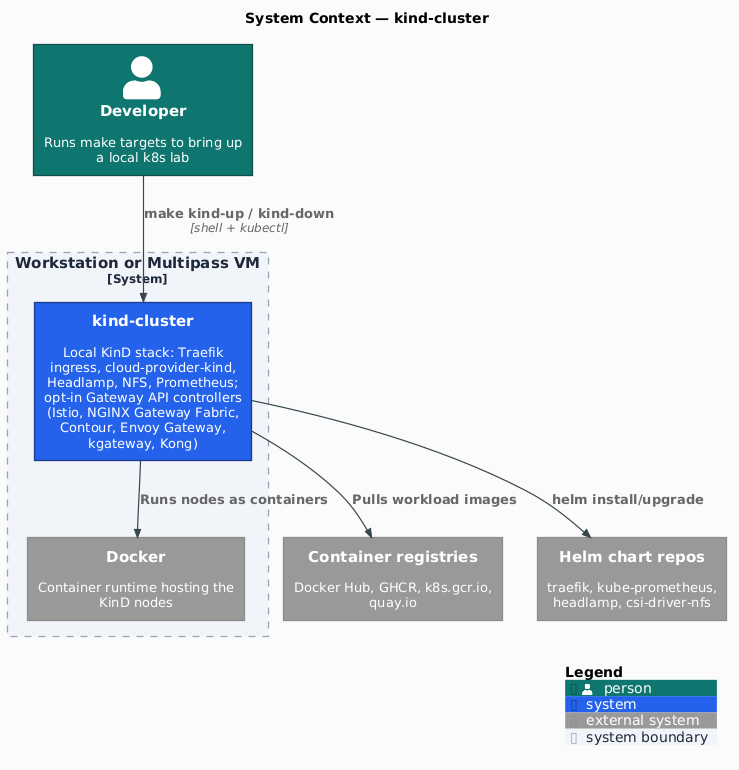
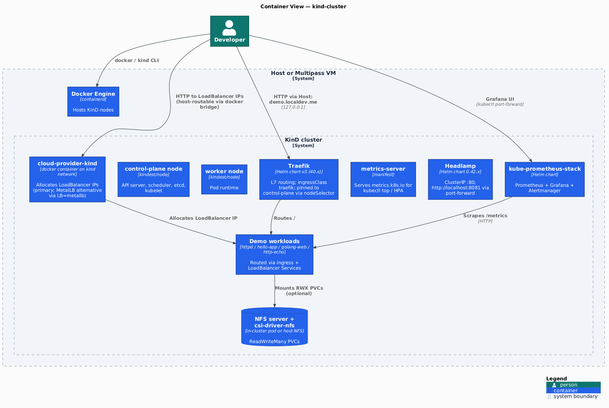
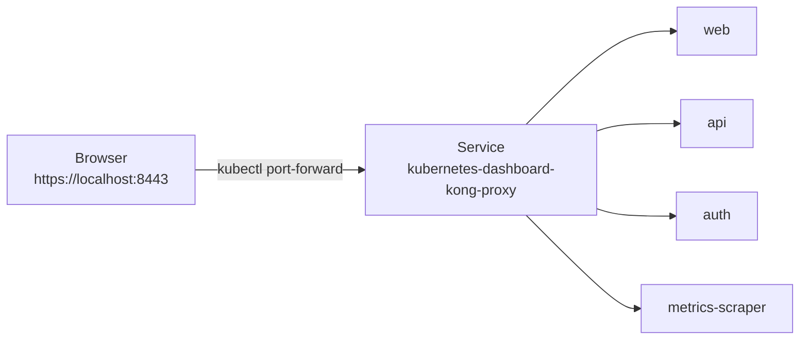
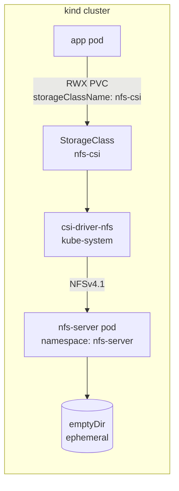
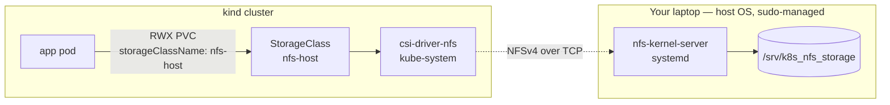
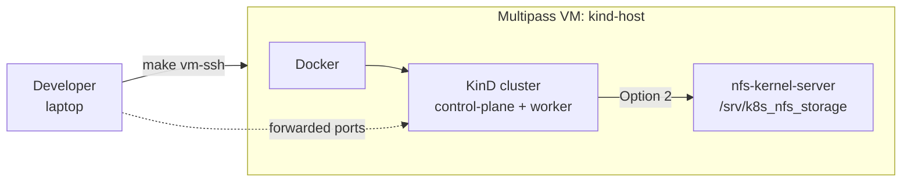

[](https://github.com/AndriyKalashnykov/kind-cluster/actions/workflows/ci.yml)
[](https://hits.sh/github.com/AndriyKalashnykov/kind-cluster/)
[](https://opensource.org/licenses/MIT)
[](https://app.renovatebot.com/dashboard#github/AndriyKalashnykov/kind-cluster)

# kind-cluster

Local Kubernetes lab on Docker via [KinD](https://kind.sigs.k8s.io/) — ingress, LoadBalancer (cloud-provider-kind, or MetalLB), Dashboard, RWX NFS storage, and Prometheus wired up out of the box. Run on your host, or inside a throwaway Multipass VM.



| Component | Technology | Rationale |
|-----------|-----------|-----------|
| Cluster | [KinD](https://kind.sigs.k8s.io/) v0.31.0 on Docker | Fastest local k8s — single binary, multi-node config, no VM overhead |
| Ingress | [ingress-nginx](https://kubernetes.github.io/ingress-nginx/) | Reference controller; matches what most cloud-managed clusters expose |
| Load Balancer (default) | [cloud-provider-kind](https://github.com/kubernetes-sigs/cloud-provider-kind) v0.10.0 | One host container watches `Service: LoadBalancer` and hands out IPs from the `kind` docker bridge — routable from your laptop with zero extra setup. Kind-team maintained. |
| Load Balancer (alternative) | [MetalLB](https://metallb.universe.tf/) v0.15.3 | In-cluster install (controller + `speaker` DaemonSet + CRDs). Pick it when you need L2/BGP announcement parity with prod. Enable with `LB=metallb make install-all` — see [Which LoadBalancer?](#which-loadbalancer). |
| Storage (RWX) | [csi-driver-nfs](https://github.com/kubernetes-csi/csi-driver-nfs) v4.13.1 | Same driver backs both in-cluster and host-NFS modes — only the StorageClass differs |
| Observability | [kube-prometheus-stack](https://github.com/prometheus-community/helm-charts) | One-shot Prometheus + Grafana + Alertmanager + node-exporter for HPA / dashboards |
| Dashboard | [Kubernetes Dashboard](https://github.com/kubernetes/dashboard) v7.x | Helm chart v7 ships Kong-fronted dashboard with admin token in repo root |
| CI | GitHub Actions | `make deps` + `make create-cluster` — same Makefile path users hit locally; CI verifies install scripts on every push |

## Architecture



Source: [`docs/diagrams/c4-container.puml`](./docs/diagrams/c4-container.puml). Render with `make diagrams` (uses pinned `plantuml/plantuml` Docker image).

The cluster runs entirely on the local Docker bridge. The LoadBalancer provider (cloud-provider-kind by default) hands out `Service: LoadBalancer` IPs from the bridge's IPv4 subnet, so demo apps are reachable directly via `curl <LB_IP>:<port>` from the host.

Ingress is pinned to the control-plane node (via the `ingress-ready` nodeSelector label). `kind-config.yaml` maps host ports 80/443 to that node, so `http://demo.localdev.me/` resolves through the host port — independent of which LoadBalancer provider is active.

The dashboard's Kong proxy listens on port 8443 inside the cluster — reach it via the `dashboard-forward` target.

### Which LoadBalancer?

The default is **cloud-provider-kind** (CPK). Simpler setup, kind-team maintained. Stick with it unless you have a specific reason to pick MetalLB.

| | cloud-provider-kind (default) | MetalLB |
|---|---|---|
| Install form | host `docker run` on the `kind` network | in-cluster Deployment + DaemonSet + CRDs |
| IP allocation | automatic from the `kind` Docker subnet | you declare an `IPAddressPool` range |
| Maintenance | kind-team, single binary | independent release cadence |
| When to pick | works for everything this repo deploys | you need BGP / L2Advertisement parity with prod, or want to reproduce a MetalLB-specific bug |

Two entry points to MetalLB:

```bash
LB=metallb make install-all    # fresh cluster with MetalLB as the LB provider
make lb-metallb                # already-running cluster, no LB yet — install MetalLB only
```

Switching providers on a live cluster requires tearing down the first one — each script hard-refuses if the other is present. Run `make kind-down && LB=<provider> make kind-up` for a clean reset.

## Quick Start

```bash
make deps        # auto-bootstraps mise + installs pinned tools from .mise.toml
make kind-up     # create cluster + Nginx ingress + cloud-provider-kind + demo workloads
kubectl cluster-info --context kind-kind
echo "127.0.0.1 demo.localdev.me" | sudo tee -a /etc/hosts   # one-time
# Open http://demo.localdev.me/
make kind-down   # tear down
```

`kind-up` is a docker-compose-style alias for `install-all`. For the cluster and add-ons without the demo apps, run `make install-all-no-demo-workloads`.

Once the stack is up, see [**Access services**](#access-services) for discovering LoadBalancer IPs and opening service URLs — the same section covers both bare-host (`make kind-up`) and VM (`make vm-install-all`) paths.

## Prerequisites

User provides (host-level):

| Tool | Version | Purpose |
|------|---------|---------|
| [GNU Make](https://www.gnu.org/software/make/) | 3.81+ | Task orchestration |
| [Git](https://git-scm.com/) | latest | Version control |
| [Docker](https://www.docker.com/) | latest | Container runtime for KinD nodes |
| [helm](https://helm.sh/docs/intro/install/) | v3+ | Chart-based installs (dashboard, Prometheus, NFS) |
| [curl](https://curl.se/) | latest | Download helpers used by scripts |
| [base64](https://command-not-found.com/base64) | latest | Token decoding for dashboard access |

Pinned in [`.mise.toml`](./.mise.toml), auto-installed by `make deps` via [mise](https://mise.jdx.dev) (mise itself is bootstrapped into `~/.local/bin` on first run):

| Tool | Pinned version |
|------|----------------|
| [kind](https://kind.sigs.k8s.io/) | 0.31.0 |
| [kubectl](https://kubernetes.io/docs/tasks/tools/) | 1.35.1 |
| [jq](https://github.com/jqlang/jq) | 1.8.1 |
| [shellcheck](https://github.com/koalaman/shellcheck) | 0.11.0 |
| [actionlint](https://github.com/rhysd/actionlint) | 1.7.12 |
| [gitleaks](https://github.com/gitleaks/gitleaks) | 8.30.1 |
| [trivy](https://github.com/aquasecurity/trivy) | 0.69.3 |
| [hadolint](https://github.com/hadolint/hadolint) | 2.14.0 |
| [act](https://github.com/nektos/act) | 0.2.87 |

Renovate's native `mise` manager keeps `.mise.toml` up to date (platform automerge enabled).

## Kubernetes Dashboard install

Pinned to Helm chart [`kubernetes-dashboard`](https://github.com/kubernetes/dashboard) **v7.14.0**. Dashboard v7 splits the monolithic v2 service into microservices (`api`, `web`, `auth`, `metrics-scraper`) behind a **Kong Gateway** reverse proxy — you port-forward the `kong-proxy` Service, not a pod.



```bash
make dashboard-install   # helm upgrade --install + apply admin ServiceAccount + write token to dashboard-admin-token.txt
make dashboard-forward   # kubectl port-forward svc/kubernetes-dashboard-kong-proxy 8443:443 + xdg-open
make dashboard-token     # print the admin-user token
```

At the login screen, select **Token** and paste the token printed by `make dashboard-token`. See [Access services · Kubernetes Dashboard](#kubernetes-dashboard) for the bare-host vs VM port-forward/tunnel recipes.

Uninstall: `helm delete kubernetes-dashboard --namespace kubernetes-dashboard`.

## NFS & RWX storage

Kubernetes default storage classes only support `ReadWriteOnce` (a PV can be mounted by a single node). To run workloads that need `ReadWriteMany` (multiple pods writing to the same volume) — e.g., CI shared caches, content-processing pipelines, WordPress clusters — you need an NFS-backed StorageClass.

Two approaches are provided. Pick one.

### Option 1 — in-cluster NFS (recommended for local dev)

An NFS server runs as a pod inside the cluster. [csi-driver-nfs](https://github.com/kubernetes-csi/csi-driver-nfs) provisions PVs backed by that pod. **No host config, no sudo, no `/etc/exports`.** Tears down cleanly with the cluster; data does not survive `make kind-down`.



```bash
make nfs-incluster
kubectl apply -f ./k8s/nfs/pvc-incluster.yaml   # sample RWX PVC
```

Pinned versions: `csi-driver-nfs` v4.13.1. Source: `scripts/kind-add-nfs-incluster.sh`.

### Option 2 — host-side NFS (persistent across cluster recreates)

The **host machine** (your laptop) runs `nfs-kernel-server` as a system service; the same `csi-driver-nfs` used by Option 1 is installed into the cluster but configured to mount exports **from the host** instead of from an in-cluster pod. Data lives on your host disk — it survives `make kind-down`. Requires sudo and works only on Linux.

Both commands run from your laptop shell (no SSH, no VM login). The split is **what each command modifies**:

- `make nfs-host-setup` modifies your **laptop OS** — `apt install nfs-kernel-server`, edits `/etc/exports`, opens the firewall, starts the systemd service. Interactive sudo.
- `make nfs-host-provisioner` reaches the **cluster** via kubectl — `helm install csi-driver-nfs` + a `StorageClass` pointing at your laptop's IP.



```bash
# Step 1 — laptop: install nfs-kernel-server, create export, open firewall (interactive sudo)
make nfs-host-setup

# Step 2 — cluster (via kubectl from the same laptop shell):
#          install csi-driver-nfs + StorageClass, point it at your laptop's IP
make nfs-host-provisioner NFS_SERVER=192.168.1.27
kubectl apply -f ./k8s/nfs/pvc.yaml             # sample RWX PVC; binds via the nfs-host StorageClass
```

Option 1 and Option 2 differ only in backend: `csi-driver-nfs` is installed once, and you pick a StorageClass (`nfs-csi` for in-cluster, `nfs-host` for host-backed). Sources: `scripts/kind-add-nfs-host-setup.sh`, `scripts/kind-add-nfs-host-provisioner.sh`.

**References:** [NFS Server on Ubuntu](https://www.tecmint.com/install-nfs-server-on-ubuntu/) · [Dynamic NFS Provisioning in k8s](https://www.linuxtechi.com/dynamic-nfs-provisioning-kubernetes/) · [RWX in KinD with NFS](https://cloudyuga.guru/hands_on_lab/nfs-kind).

## Run in a VM (Multipass)

For full reproducibility — and to keep Docker, kind, and the host NFS server off your main machine — the whole stack can run inside a throwaway Ubuntu VM. [Multipass](https://multipass.run/) ships the image, and a cloud-init YAML does the bootstrap.



### 1. Install Multipass

| Platform | Install command | Notes |
|----------|-----------------|-------|
| Ubuntu / Debian / other Linux with snap | `sudo snap install multipass` | Uses snap confinement; nested virtualization works on KVM-capable hosts |
| macOS (Apple Silicon / Intel) | `brew install --cask multipass` | Uses `hypervisor.framework` on M1/M2/M3 |
| Windows 10/11 | `winget install Canonical.Multipass` or [direct download](https://multipass.run/download/windows) | Requires Hyper-V (Pro/Enterprise) or VirtualBox |

Verify: `multipass version` should print a version string and the daemon should be reachable (`multipass list` returns a table, even if empty).

Other install methods and troubleshooting: <https://multipass.run/install>.

### 2. Launch the VM

```bash
make vm-up                                # defaults: 4 CPU / 8 GB RAM / 40 GB disk
# or override:
make vm-up CPUS=6 MEMORY=12G DISK=60G NAME=my-kind
```

First boot takes ~3–5 min (Ubuntu cloud image download, apt-get install, docker pull, kind/kubectl/helm fetch). Subsequent `vm-up` on the same `NAME` is a no-op — the command prints `VM already exists` and shows `multipass info`.

The cloud-init playbook (`vm/cloud-init.yaml`) runs once at first boot:

1. Installs Docker CE, KinD v0.31.0, kubectl v1.35.1, helm v4.1.4
2. Installs `nfs-kernel-server`, exports `/srv/k8s_nfs_storage`
3. Clones this repo to `/home/ubuntu/kind-cluster`
4. Writes `/var/lib/kind-cluster-bootstrapped` as the finished sentinel — `vm-up.sh` polls this file.

### 3. Run the stack

```bash
# Option A: interactive — SSH in, then run inside
make vm-ssh
cd ~/kind-cluster && make install-all

# Option B: remote one-shot (git pulls latest + runs install-all)
make vm-install-all
```

### 4. Tear down

```bash
make vm-down
```

Runs `multipass stop && multipass delete && multipass purge` — no stale VMs left behind.

Override `NAME` to target a specific VM: `make vm-down NAME=my-kind`.

## Access services

This section applies to **both** install paths — `make kind-up` (cluster runs in host Docker) and `make vm-install-all` (cluster runs inside a Multipass VM). Pick your path below; the rest of the section uses shell variables that are populated by commands you can copy-paste, so no `<LB_IP>`-style hand-editing.

### Access patterns

Three patterns map to three needs — the stack uses each where it fits:

| Pattern | What | Used by |
|---|---|---|
| **Ingress** | one L7 gateway (ingress-nginx) fronts every HTTP demo, routed by Host header | `demo.localdev.me`, `helloweb.localdev.me`, `golang.localdev.me`, `foo.localdev.me` |
| **LoadBalancer** | the LB provider (cloud-provider-kind or MetalLB) allocates ONE external IP — for the ingress controller — plus a distinct IP for Grafana (persistent admin UI) | ingress-nginx-controller, Grafana |
| **Port-forward** | `kubectl port-forward` from your terminal to an in-cluster Service; ephemeral, admin-only | Kubernetes Dashboard, Prometheus, Alertmanager |

All HTTP demo apps use **ingress**. Step 2–4 below set up one LB IP plus one `/etc/hosts` entry that covers every demo app.

### Step 1 — point `kubectl` at the cluster

Define a `kube` shell function that both paths use identically. A function (rather than a variable holding a multi-word command) works in both **bash** and **zsh** — zsh doesn't word-split unquoted `$VAR` references, so `KUBECTL="multipass exec … -- kubectl"; $KUBECTL get svc` fails there.

```bash
# Path A — bare host (you ran `make kind-up` on your laptop)
kube() { kubectl "$@"; }

# Path B — Multipass VM (you ran `make vm-install-all`)
NAME=${NAME:-kind-host}
VM_IP=$(multipass info "$NAME" --format json | jq -r '.info | to_entries[0].value.ipv4[0]')
kube() { multipass exec "$NAME" -- kubectl "$@"; }
echo "NAME=$NAME  VM_IP=$VM_IP"
```

From here on, every `kubectl` command is written as `kube …` so both paths run the same snippets.

### Step 2 — discover the ingress IP

Only ingress-nginx gets a LoadBalancer IP now (demo apps are ClusterIP services behind ingress). Grab it once:

```bash
INGRESS_IP=$(kube get svc -n ingress-nginx ingress-nginx-controller -o jsonpath='{.status.loadBalancer.ingress[0].ip}')
echo "INGRESS_IP=$INGRESS_IP"
```

### Step 3 — add the demo hostnames to `/etc/hosts`

All four demo apps are reached by hostname under `demo.localdev.me`, `helloweb.localdev.me`, `golang.localdev.me`, `foo.localdev.me`. Pick the target based on install path:

**Path A (bare host) and Path B · Option 1 — point them at `127.0.0.1`.** `kind-config.yaml`'s `extraPortMappings` already wires `127.0.0.1:80` to the kind control-plane node (where ingress-nginx is pinned via `ingress-ready`), so host-side ingress traffic works without touching any LB IP:

```bash
# Idempotent — replace any existing *.localdev.me entries
sudo sed -i.bak '/\.localdev\.me/d' /etc/hosts
echo "127.0.0.1 demo.localdev.me helloweb.localdev.me golang.localdev.me foo.localdev.me" | sudo tee -a /etc/hosts
```

**Path A**: skip to Step 4.

**Path B · Option 1 — SSH tunnel to the VM's ingress port.** One tunnel for all four hostnames (they all resolve to the ingress):

```bash
# One-time: authorize your host key in the VM (multipass launch does not inject it)
PUBKEY=$(cat ~/.ssh/id_ed25519.pub)
multipass exec "$NAME" -- bash -c "mkdir -p /home/ubuntu/.ssh && grep -qxF '$PUBKEY' /home/ubuntu/.ssh/authorized_keys 2>/dev/null || echo '$PUBKEY' >> /home/ubuntu/.ssh/authorized_keys && chown -R ubuntu:ubuntu /home/ubuntu/.ssh && chmod 700 /home/ubuntu/.ssh && chmod 600 /home/ubuntu/.ssh/authorized_keys"

# Forward host port 80 → VM's kind hostPort 80 (needs sudo for <1024).
sudo ssh -fN -L 80:127.0.0.1:80 ubuntu@"$VM_IP"
```

If you don't want sudo, tunnel to a non-privileged port and append `:8080` to every URL:

```bash
ssh -fN -L 8080:127.0.0.1:80 ubuntu@"$VM_IP"
# Then http://helloweb.localdev.me:8080/ , http://foo.localdev.me:8080/ , etc.
```

Kill tunnels with `pkill -f "ssh.*-L.*$VM_IP"`.

**Path B · Option 2 — Static route to the kind subnet (Linux/macOS, sudo once, no port suffix).**

Route to the VM's kind docker subnet + allow DOCKER-USER forwards, then point `/etc/hosts` at `$INGRESS_IP` instead of `127.0.0.1`:

```bash
# [HOST] — discover the kind IPv4 subnet (modern Docker lists IPv6 first when dual-stack)
KIND_NET=$(multipass exec "$NAME" -- bash -lc "docker network inspect kind | jq -r '.[0].IPAM.Config[] | select(.Subnet | test(\"^[0-9]+\\\\.\")) | .Subnet' | head -1")

# [VM] — Docker installs a default `FORWARD DROP` policy; allow the kind subnet.
multipass exec "$NAME" -- sudo iptables -I DOCKER-USER -s "$KIND_NET" -j ACCEPT
multipass exec "$NAME" -- sudo iptables -I DOCKER-USER -d "$KIND_NET" -j ACCEPT

# [HOST] — static route
sudo ip route add "$KIND_NET" via "$VM_IP"                             # Linux
# sudo route -n add -net "$KIND_NET" "$VM_IP"                          # macOS

# [HOST] — repoint /etc/hosts from 127.0.0.1 to $INGRESS_IP
sudo sed -i.bak '/\.localdev\.me/d' /etc/hosts
echo "$INGRESS_IP demo.localdev.me helloweb.localdev.me golang.localdev.me foo.localdev.me" | sudo tee -a /etc/hosts
```

Cleanup when you're done:

```bash
sudo ip route del "$KIND_NET"                                          # Linux
# sudo route -n delete -net "$KIND_NET"                                # macOS
sudo sed -i.bak '/\.localdev\.me/d' /etc/hosts
# DOCKER-USER rules go away with the VM.
```

Caveat: routes are kernel-wide and collide if another tool on your host already uses `172.18.0.0/16` (e.g., local Docker Desktop). If so, recreate the VM with a different docker bridge subnet or stick with Option 1.

### Step 4 — hit the URLs

All four demo apps go through ingress. Same URLs on all paths (Path B · Option 1 adds `:8080` if you chose the no-sudo tunnel):

```bash
curl http://demo.localdev.me/              # "It works!"  (httpd)
curl http://helloweb.localdev.me/          # "Hello, world!"  (Google hello-app)
curl http://golang.localdev.me/myhello/    # golang-web
curl http://golang.localdev.me/healthz     # golang-web health
curl http://foo.localdev.me/               # "foo" or "bar"  (http-echo; Service load-balances)
```

| Service | URL |
|---|---|
| ingress demo (httpd) | `http://demo.localdev.me/` |
| helloweb | `http://helloweb.localdev.me/` |
| golang-hello-world-web | `http://golang.localdev.me/myhello/` · `/healthz` |
| foo-bar-service | `http://foo.localdev.me/` |

### Kubernetes Dashboard

The dashboard listens on port 8443 inside the cluster. Same flow on both paths: a `kubectl port-forward`. Path B adds an outer SSH tunnel to reach the VM.

```bash
# Path A — port-forward directly from your host (foreground; Ctrl+C to stop)
make dashboard-forward

# Path B — port-forward runs inside the VM (terminal 1), outer tunnel from host (terminal 2)
# terminal 1:  make vm-ssh   →   make dashboard-forward
# terminal 2:
ssh -fN -L 8443:localhost:8443 ubuntu@"$VM_IP"

# Both paths — grab the admin token for the login screen (reuses the `kube` function from Step 1)
kube -n kubernetes-dashboard create token admin-user
```

Browser: `https://localhost:8443`

## Observability

### kube-prometheus-stack (Prometheus + Grafana + Alertmanager)

Installs the community [`kube-prometheus-stack`](https://github.com/prometheus-community/helm-charts/tree/main/charts/kube-prometheus-stack) Helm chart into the `monitoring` namespace. Grafana is exposed via the LoadBalancer provider (whichever you picked); Prometheus and Alertmanager stay ClusterIP — reach them via `kubectl port-forward`.

The credential-discovery snippets reuse the `kube` function from [Access services · Step 1](#step-1--point-kubectl-at-the-cluster). Paths labelled **[HOST]** run on your laptop; **[VM]** run inside the Multipass VM.

#### Path A — bare host (`make kind-up`)

`port-forward` from your laptop binds host-local ports — directly reachable in your browser.

```bash
# [HOST]
make kube-prometheus-stack

GRAFANA_IP=$(kube get svc -n monitoring kube-prometheus-stack-grafana -o jsonpath='{.status.loadBalancer.ingress[0].ip}')
GRAFANA_PASSWORD=$(kube get secret -n monitoring kube-prometheus-stack-grafana -o jsonpath='{.data.admin-password}' | base64 -d)
echo "Grafana:       http://$GRAFANA_IP/   (admin / $GRAFANA_PASSWORD)"

kube port-forward -n monitoring svc/kube-prometheus-stack-prometheus    9090:9090 >/dev/null 2>&1 &
kube port-forward -n monitoring svc/kube-prometheus-stack-alertmanager  9093:9093 >/dev/null 2>&1 &
echo "Prometheus:    http://localhost:9090/   (targets: /targets)"
echo "Alertmanager:  http://localhost:9093/"
```

#### Path B — Multipass VM (`make vm-install-all`)

Install runs inside the VM. `kube port-forward` would bind the VM's localhost (not your host's) — so the port-forward stays in the VM and you add an outer SSH tunnel from the host. Grafana goes through the LoadBalancer provider so the access mode depends on which Option from §Access services Step 3 you picked.

```bash
# [VM] — install + start in-VM port-forwards
multipass exec "$NAME" -- bash -lc 'cd ~/kind-cluster && make kube-prometheus-stack'
multipass exec "$NAME" -- bash -lc 'nohup kubectl port-forward -n monitoring svc/kube-prometheus-stack-prometheus    9090:9090 >/dev/null 2>&1 & disown'
multipass exec "$NAME" -- bash -lc 'nohup kubectl port-forward -n monitoring svc/kube-prometheus-stack-alertmanager  9093:9093 >/dev/null 2>&1 & disown'

# [HOST] — discover credentials
GRAFANA_IP=$(kube get svc -n monitoring kube-prometheus-stack-grafana -o jsonpath='{.status.loadBalancer.ingress[0].ip}')
GRAFANA_PASSWORD=$(kube get secret -n monitoring kube-prometheus-stack-grafana -o jsonpath='{.data.admin-password}' | base64 -d)

# [HOST] — outer SSH tunnels for Prometheus + Alertmanager (always needed for Path B)
ssh -fN -L 9090:localhost:9090 ubuntu@"$VM_IP"
ssh -fN -L 9093:localhost:9093 ubuntu@"$VM_IP"

# [HOST] — Grafana access depends on which §Access services Option you picked:
#   Path B · Option 1 (SSH tunnel):  add another tunnel on a free local port
ssh -fN -L 3000:"$GRAFANA_IP":80 ubuntu@"$VM_IP"
echo "Grafana (Option 1):  http://localhost:3000/  (admin / $GRAFANA_PASSWORD)"
#   Path B · Option 2 (static route): the LB IP is already routable from host
echo "Grafana (Option 2):  http://$GRAFANA_IP/      (admin / $GRAFANA_PASSWORD)"

echo "Prometheus:    http://localhost:9090/   (targets: /targets)"
echo "Alertmanager:  http://localhost:9093/"
```

Summary — pick the column matching your install path:

| Component | Path A (`http://…`) | Path B · Option 1 | Path B · Option 2 |
|---|---|---|---|
| Grafana | `http://$GRAFANA_IP/` | `http://localhost:3000/` | `http://$GRAFANA_IP/` |
| Prometheus | `http://localhost:9090/` | `http://localhost:9090/` | `http://localhost:9090/` |
| Alertmanager | `http://localhost:9093/` | `http://localhost:9093/` | `http://localhost:9093/` |
| Login (Grafana) | `admin` / `$GRAFANA_PASSWORD` | same | same |

If you're running inside a Multipass VM, prefix with `multipass exec $NAME --` or run the port-forward inside the VM and add a host-side SSH tunnel exactly like the Dashboard flow in §4 above (replace `8443` with `9090` / `9093`).

### metrics-server

Required for `kubectl top` and HorizontalPodAutoscalers. On KinD, the default manifest is patched with `--kubelet-insecure-tls` (the KinD kubelet serving cert isn't signed by the cluster CA).

```bash
make metrics-server
```

## Local Docker Registry

For pushing locally-built images without going through Docker Hub/GHCR, `make registry` creates a fresh KinD cluster wired to a Docker registry at `localhost:5001` — containerd on the kind nodes mirrors that registry, so pods can pull `localhost:5001/<image>:<tag>` directly.

```bash
make registry         # create cluster + registry container
make registry-test    # pull hello-app, retag to localhost:5001, push, deploy, curl
```

This is an **alternative** to the default `make install-all` flow — the registry cluster doesn't include ingress, a LoadBalancer provider, or the demo workloads. Useful for iterating on an image you're building locally. Tear down with `make delete-cluster` and remove the registry container with `docker rm -f kind-registry`.

## Available Make Targets

`make help` is the authoritative list. The table below groups targets by purpose for scanning.

| Category | Target | Description |
|---|---|---|
| Cluster | `make kind-up` | docker-compose-style alias for `install-all` (bring the whole stack up) |
| Cluster | `make kind-down` | docker-compose-style alias for `delete-cluster` (tear the whole stack down) |
| Cluster | `make install-all` | cluster + Nginx ingress + LoadBalancer (CPK default, or `LB=metallb`) + demo workloads |
| Cluster | `make install-all-no-demo-workloads` | same minus demo apps |
| Cluster | `make create-cluster` | Create KinD cluster only |
| Cluster | `make delete-cluster` | Delete KinD cluster only |
| Cluster | `make export-cert` | Export k8s client keys and CA certificates |
| Cluster | `make e2e` | Smoke-test deployed demo services on a running cluster |
| Cluster | `make clean` | Tear down cluster + remove scratch artifacts |
| Add-ons | `make dashboard-install` | Kubernetes Dashboard (Helm chart v7.14.0) + admin ServiceAccount |
| Add-ons | `make dashboard-forward` | Port-forward dashboard to `https://localhost:8443` and open browser |
| Add-ons | `make dashboard-token` | Print the admin-user token |
| Add-ons | `make nginx-ingress` | Install Nginx ingress controller |
| Add-ons | `make lb-cpk` | Install cloud-provider-kind (default LoadBalancer) |
| Add-ons | `make lb-metallb` | Install MetalLB (alternative; also: `LB=metallb make install-all`) |
| Add-ons | `make metrics-server` | metrics-server (for `kubectl top` / HPA) |
| Add-ons | `make kube-prometheus-stack` | Prometheus + Grafana + Alertmanager |
| NFS | `make nfs-incluster` | Option 1 — in-cluster NFS server + csi-driver-nfs (no host config) |
| NFS | `make nfs-host-setup` | Option 2, step 1 — configure host as NFS server (sudo; Ubuntu/Debian) |
| NFS | `make nfs-host-provisioner NFS_SERVER=<ip>` | Option 2, step 2 — install csi-driver-nfs pointing at the host export |
| Demo apps | `make deploy-app-nginx-ingress-localhost` | httpd behind ingress at `http://demo.localdev.me/` |
| Demo apps | `make deploy-app-helloweb` | helloweb sample |
| Demo apps | `make deploy-app-golang-hello-world-web` | golang-hello-world-web sample |
| Demo apps | `make deploy-app-foo-bar-service` | foo-bar-service (two backends behind one Service) |
| Multipass VM | `make vm-up` | launch Ubuntu 22.04 VM + cloud-init provisioning |
| Multipass VM | `make vm-ssh` | open a shell inside the VM |
| Multipass VM | `make vm-install-all` | run `make install-all` inside the VM |
| Multipass VM | `make vm-down` | stop, delete, purge the VM |
| Registry | `make registry` | KinD cluster wired to local Docker registry at `localhost:5001` |
| Registry | `make registry-test` | push `hello-app:1.0` to the local registry and deploy it |
| Utilities | `make deps` | bootstrap mise + install pinned tools from `.mise.toml`; verify docker/helm/curl/base64 on PATH |
| Utilities | `make image-build` | build `kubectl-test` Docker image |
| Utilities | `make renovate-validate` | validate `renovate.json` |
| Quality | `make lint` | shellcheck + actionlint + hadolint + scripts-exec-bit check |
| Quality | `make secrets` | gitleaks (suppressions: `.gitleaks.toml`) |
| Quality | `make trivy-fs` | Trivy fs scan (vulns, secrets, misconfigs; CRITICAL/HIGH) |
| Quality | `make trivy-config` | Trivy scan of `k8s/` manifests |
| Quality | `make mermaid-lint` | validate mermaid blocks in tracked `*.md` files |
| Quality | `make diagrams` | render PlantUML C4 diagrams (via pinned `plantuml/plantuml` image) |
| Quality | `make diagrams-check` | verify committed PNGs match current `.puml` source |
| Quality | `make diagrams-clean` | remove rendered PNGs under `docs/diagrams/out/` |
| Quality | `make static-check` | composite: lint + secrets + trivy-fs + trivy-config + mermaid-lint + diagrams-check |
| Quality | `make ci` | full local pipeline: `static-check` + `renovate-validate` |
| Quality | `make ci-run` | run the GitHub Actions workflow locally via [act](https://github.com/nektos/act) |

Suppressions (intentional, justified inline):
- `.gitleaks.toml` — allowlist for the local `dashboard-admin-token.txt`.
- `.trivyignore.yaml` — demo workloads use default securityContext, the in-cluster NFS pod needs privileged mode.
- `.hadolint.yaml` — `kubectl-test` is a throwaway debug image; alpine-package pinning is overkill.

## CI/CD

`ci.yml` runs on every push to `main`, tags `v*`, and pull requests. A separate `e2e-metallb.yml` exercises the MetalLB path on a weekly cron (Sunday 04:00 UTC) plus pushes that touch `scripts/kind-add-metallb.sh`.

| Job | Needs | Steps |
|-----|-------|-------|
| **static-check** | — | `make static-check` (lint + secrets + trivy-fs + trivy-config + mermaid-lint + diagrams-check) |
| **docker** | static-check | `make image-test` — build and runtime-verify the `kubectl-test` image |
| **e2e** | static-check | `jdx/mise-action` + `make deps` + `make create-cluster`, install ingress + cloud-provider-kind + dashboard, deploy all demo workloads, run `make e2e` for body-asserting smoke tests via `docker exec` (~4 min end-to-end) |
| **e2e-metallb** | — | Mirrors `e2e` but installs MetalLB instead of cloud-provider-kind. Weekly cron (Sun 04:00 UTC) + `workflow_dispatch` + push to `scripts/kind-add-metallb.sh`. Catches MetalLB regressions without taxing every PR. |
| **ci-pass** | static-check, docker, e2e | Aggregate gate — fails if any upstream job failed or was cancelled |

A separate `cleanup-runs.yml` workflow prunes old workflow runs on a weekly schedule (Sunday midnight).

No repo secrets or variables are required by the workflow — only the default `GITHUB_TOKEN`.

[Renovate](https://docs.renovatebot.com/) keeps action digests, container images, `.mise.toml` pins (via the native `mise` manager), and Makefile / `scripts/*.sh` constants (via `# renovate:` inline comments) up to date with platform automerge enabled.

## Contributing

Contributions welcome — open a PR. Run `make ci` locally before submitting.

## License

MIT — see [LICENSE](./LICENSE).
