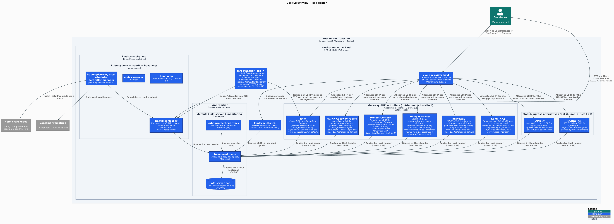
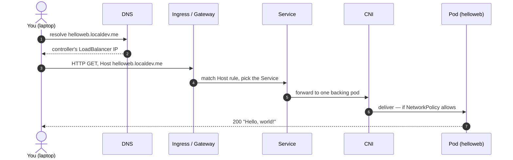
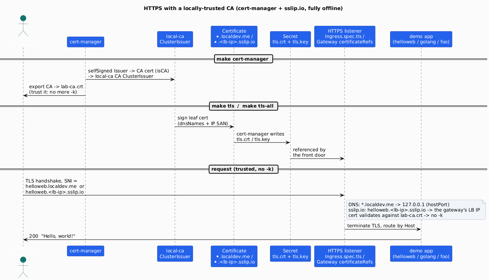
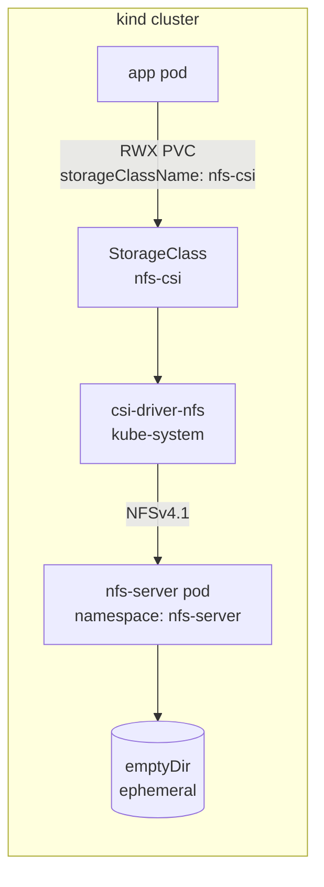
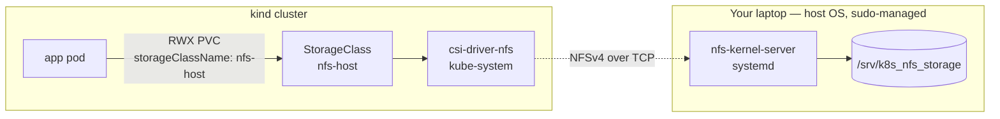
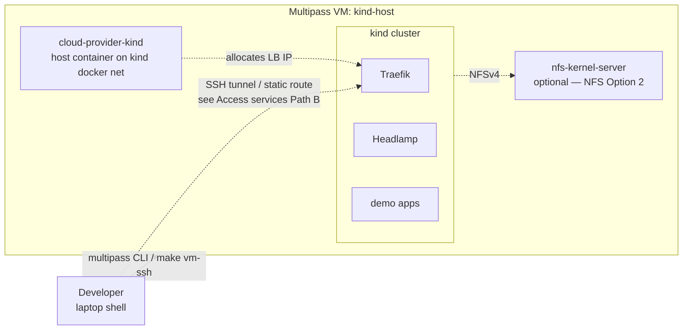

[](https://github.com/AndriyKalashnykov/kind-cluster/actions/workflows/ci.yml)
[](https://hits.sh/github.com/AndriyKalashnykov/kind-cluster/)
[](https://opensource.org/licenses/MIT)
[](https://app.renovatebot.com/dashboard#github/AndriyKalashnykov/kind-cluster)

# Local Kubernetes Lab on KinD

Spin up a Kubernetes cluster in Docker ([KinD](https://kind.sigs.k8s.io/)) and compare 3 classic Ingress and 7 [Gateway API](docs/gateway-api-ingress.md) controllers coexisting on it — each on its own LoadBalancer IP, all routing the same demo apps. The LoadBalancer (cloud-provider-kind or MetalLB), Headlamp dashboard, Prometheus/Grafana, ReadWriteMany NFS, and local registry are opt-in; run on your host or a throwaway Multipass VM.


| Component | Technology | Rationale |
|-----------|-----------|-----------|
| Cluster | [KinD](https://kind.sigs.k8s.io/) v0.32.0 on Docker | Fastest local k8s — single binary, multi-node config, no VM overhead |
| Ingress | [Traefik](https://traefik.io/) v3 (chart 40.x) | Replaces the [retired](https://www.kubernetes.io/blog/2025/11/11/ingress-nginx-retirement/) ingress-nginx; supports `networking.k8s.io/v1` Ingress + Gateway API on one binary |
| Load Balancer (default) | [cloud-provider-kind](https://github.com/kubernetes-sigs/cloud-provider-kind) v0.10.0 | One host container watches `Service: LoadBalancer` and hands out IPs from the `kind` docker bridge — routable from your laptop with zero extra setup. Kind-team maintained. |
| Load Balancer (alternative) | [MetalLB](https://metallb.universe.tf/) v0.16.0 | In-cluster install (controller + `speaker` DaemonSet + CRDs). Pick it when you need L2/BGP announcement parity with prod. Enable with `LB=metallb make install-all` — see [Which LoadBalancer?](#which-loadbalancer). |
| Storage (RWX) | [csi-driver-nfs](https://github.com/kubernetes-csi/csi-driver-nfs) v4.13.2 | Same driver backs both in-cluster and host-NFS modes — only the StorageClass differs |
| Observability | [kube-prometheus-stack](https://github.com/prometheus-community/helm-charts) | One-shot Prometheus + Grafana + Alertmanager + node-exporter for HPA / dashboards |
| Web UI | [Headlamp](https://github.com/kubernetes-sigs/headlamp) 0.42.x | SIG-UI-endorsed Kubernetes UI (successor to the archived `kubernetes/dashboard`); single-pod ClusterIP with token-based login |
| CI | GitHub Actions | `make deps` + `make kind-create` — same Makefile path users hit locally; CI verifies install scripts on every push |

## Quick Start

```bash
make deps        # auto-bootstraps mise + installs pinned tools from .mise.toml
make kind-up     # create cluster + Traefik ingress + cloud-provider-kind + demo workloads
kubectl cluster-info --context kind-kind
echo "127.0.0.1 demo.localdev.me" | sudo tee -a /etc/hosts   # one-time
# Open http://demo.localdev.me/
make kind-down   # tear down
```

`kind-up` is a docker-compose-style alias for `install-all`. For the cluster and add-ons without the demo apps, run `make install-all-no-demo-workloads`.

Once the stack is up, see [**Access services**](#access-services) for discovering LoadBalancer IPs and opening service URLs — the same section covers both bare-host (`make kind-up`) and VM (`make vm-install-all`) paths.

## Prerequisites

User provides (host-level):

| Tool | Version | Purpose |
|------|---------|---------|
| [GNU Make](https://www.gnu.org/software/make/) | 3.81+ | Task orchestration |
| [Git](https://git-scm.com/) | latest | Version control |
| [Docker](https://www.docker.com/) | latest | Container runtime for KinD nodes |
| [helm](https://helm.sh/docs/intro/install/) | v3+ | Chart-based installs (Headlamp, Prometheus, NFS) |
| [curl](https://curl.se/) | latest | Download helpers used by scripts |
| [base64](https://command-not-found.com/base64) | latest | Token decoding for Headlamp access |

Pinned in [`.mise.toml`](./.mise.toml), auto-installed by `make deps` via [mise](https://mise.jdx.dev) (mise itself is bootstrapped into `~/.local/bin` on first run):

| Tool | Pinned version |
|------|----------------|
| [kind](https://kind.sigs.k8s.io/) | 0.32.0 |
| [kubectl](https://kubernetes.io/docs/tasks/tools/) | 1.36.2 |
| [jq](https://github.com/jqlang/jq) | 1.8.1 |
| [shellcheck](https://github.com/koalaman/shellcheck) | 0.11.0 |
| [actionlint](https://github.com/rhysd/actionlint) | 1.7.12 |
| [gitleaks](https://github.com/gitleaks/gitleaks) | 8.30.1 |
| [trivy](https://github.com/aquasecurity/trivy) | 0.71.0 |
| [hadolint](https://github.com/hadolint/hadolint) | 2.14.0 |
| [act](https://github.com/nektos/act) | 0.2.89 |
| [bats](https://github.com/bats-core/bats-core) | 1.13.0 |

Renovate's native `mise` manager keeps `.mise.toml` up to date (automerge enabled).

## Architecture

### Container View


Source: [`docs/diagrams/c4-container.puml`](./docs/diagrams/c4-container.puml). Render with `make diagrams` (uses pinned `plantuml/plantuml` Docker image).

The cluster runs entirely on the local Docker bridge. The LoadBalancer provider (cloud-provider-kind by default) hands out `Service: LoadBalancer` IPs from the bridge's IPv4 subnet, so demo apps are reachable directly via `curl <LB_IP>:<port>` from the host.

Ingress is pinned to the control-plane node (via the `ingress-ready` nodeSelector label). `kind-config.yaml` maps host ports 80/443 to that node, so `http://demo.localdev.me/` resolves through the host port — independent of which LoadBalancer provider is active.

Headlamp listens on port 80 inside the cluster — reach it via the `headlamp-forward` target (forwards to `http://localhost:8081`).

### Deployment View



Source: [`docs/diagrams/c4-deployment.puml`](./docs/diagrams/c4-deployment.puml).

- **`kind-control-plane` node** — kindest/node container running kube-apiserver/etcd/scheduler plus Traefik (pinned here via the `ingress-ready=true` nodeSelector + control-plane toleration), with Headlamp and metrics-server scheduled cluster-wide.
- **`kind-worker` node** — runs application workloads (demo apps, in-cluster NFS server pod, kube-prometheus-stack).
- **`cloud-provider-kind`** — host docker container watching `Service: LoadBalancer` on the kind docker network; allocates LB IPs from the kind subnet (172.18.0.0/16 by default).
- **`kindccm-<hash>`** — per-Service Envoy sidecars spawned by cloud-provider-kind that route LB-IP traffic to backend pods. Cleaned up by `make kind-destroy` (failing to clean these up was the cause of the K1.5 "connection reset on first curl" flake — see `scripts/kind-delete.sh`).
- **Developer access** — host port 80/443 forwards to Traefik via `kind-config.yaml` extraPortMappings (and Traefik's chart hostPort overrides), so `http://*.localdev.me/` resolves through the kind host port without needing the LB IP. The LB IP route is also host-routable for direct-IP access.

### Which LoadBalancer?

The default is **cloud-provider-kind** (CPK). Simpler setup, kind-team maintained. Stick with it unless you have a specific reason to pick MetalLB.

| | cloud-provider-kind (default) | MetalLB |
|---|---|---|
| Install form | host `docker run` on the `kind` network | in-cluster Deployment + DaemonSet + CRDs |
| IP allocation | automatic from the `kind` Docker subnet | you declare an `IPAddressPool` range |
| Maintenance | kind-team, single binary | independent release cadence |
| When to pick | works for everything this repo deploys | you need BGP / L2Advertisement parity with prod, or want to reproduce a MetalLB-specific bug |

Two entry points to MetalLB:

```bash
LB=metallb make install-all    # fresh cluster with MetalLB as the LB provider
make lb-metallb                # already-running cluster, no LB yet — install MetalLB only
```

Switching providers on a live cluster requires tearing down the first one — each script hard-refuses if the other is present. Run `make kind-down && LB=<provider> make kind-up` for a clean reset.

## Ingress vs Gateway API

The default routing path is **classic Ingress** (`networking.k8s.io/v1`, `ingressClassName: traefik`) — the simplest thing that works. The Kubernetes **[Gateway API](https://gateway-api.sigs.k8s.io/)** is its GA successor (the Ingress API is frozen; ingress-nginx retired March 2026 — the reason this project moved to Traefik). **Traefik**, **Istio**, **NGINX Gateway Fabric**, **Contour**, **Envoy Gateway**, **kgateway**, and **Kong** are all conformant Gateway API controllers and can be enabled here opt-in, each routing the **same** demo apps:

```bash
make gateway-traefik    # enable Traefik's Gateway API provider (same pod also keeps classic Ingress)
make gateway-istio      # add Istio as a 2nd Gateway API controller, its own LB IP, same backends
make gateway-nginx      # add NGINX Gateway Fabric (the Gateway-API successor to ingress-nginx), its own LB IP, same backends
make gateway-contour    # add Project Contour (Gateway provisioner), its own LB IP, same backends
make gateway-envoy      # add Envoy Gateway (CNCF), its own LB IP, same backends
make gateway-kgateway   # add kgateway (CNCF, formerly Gloo OSS), its own LB IP, same backends
make gateway-kong       # add Kong (KIC, unmanaged Gateway), its own LB IP, same backends (also serves classic Ingress)
```

All seven vendor a Gateway API **≥ v1.2.0** client (v1.5.x for most; Kong/KIC v1.3.0), so they coexist on the shared experimental-channel CRDs without the `supportedFeatures` deserialization crash that dropped HAProxy — whose client predated the v1.2.0 `[]string`→`[]object` change to `GatewayClass.status.supportedFeatures`.

They coexist because each GatewayClass has a distinct `controllerName` and cloud-provider-kind gives each gateway its own LoadBalancer IP. **Antrea is *not* in this comparison** — it's a CNI, not a Gateway API controller (its "gateway" is the `antrea-gw0` dataplane interface); the real CNI-integrated gateways are **Cilium** / **Calico**.

### Reaching each gateway

Every controller's `Gateway` gets its **own** LoadBalancer IP from cloud-provider-kind. List them (all seven `Gateway` objects live in the `default` namespace):

```bash
kubectl get gateway
# NAME              CLASS      ADDRESS      PROGRAMMED
# traefik-gateway   traefik    172.18.0.4   True
# istio             istio      172.18.0.6   True
# ngf               nginx      172.18.0.7   True
# contour           contour    172.18.0.8   True
# eg                envoy      172.18.0.9   True
# kgw               kgateway   172.18.0.10  True
# kong              kong       172.18.0.11  True
```

**Traefik**'s Gateway API provider shares Traefik's ingress IP, so its HTTPRoutes use `*.gw.localdev.me` (to avoid colliding with the classic Ingress `*.localdev.me` on the same pod):

```bash
GW=$(kubectl get gateway traefik-gateway -o jsonpath='{.status.addresses[0].value}')
curl -H "Host: helloweb.gw.localdev.me" "http://$GW/"        # Hello, world!
curl -H "Host: golang.gw.localdev.me"  "http://$GW/healthz"  # {"health":"ok"}
```

**Istio** (`demo`), **NGINX Gateway Fabric** (`ngf`), **Contour** (`contour`), **Envoy Gateway** (`eg`), **kgateway** (`kgw`), and **Kong** (`kong`) each have their own IP and reuse the plain `*.localdev.me` hostnames — so target each by its IP. The same hostname can't point at six IPs in `/etc/hosts`, so pass it as a `Host:` header (or use `curl --resolve helloweb.localdev.me:80:<ip>`):

```bash
for gw in demo ngf contour eg kgw kong; do
  IP=$(kubectl get gateway "$gw" -o jsonpath='{.status.addresses[0].value}')
  echo "== $gw @ $IP =="
  curl -H "Host: helloweb.localdev.me" "http://$IP/"          # same backend, different front door
done
```

`TEST_GATEWAY_API=yes make e2e-smoke` runs exactly these assertions across all seven controllers.

### Alternative classic Ingress controllers (opt-in)

The default classic-Ingress path is **Traefik** (`ingressClassName: traefik`). Two more classic Ingress controllers can be enabled side-by-side as opt-in alternatives — each registers a **distinct `ingressClassName`**, reconciles only its own `Ingress` objects, and gets its **own** cloud-provider-kind LB IP, fronting the **same** demo apps:

```bash
make ingress-haproxy   # HAProxy (haproxytech) — ingressClassName: haproxy, its own LB IP
make ingress-nginx     # NGINX Inc. (F5 OSS, ≠ the retired community ingress-nginx) — ingressClassName: nginx
```

These are **immune** to the Gateway API v1.5.1 `supportedFeatures` crash that dropped HAProxy from *Gateway API* mode — a classic Ingress controller never watches `GatewayClass`. (`IngressClass nginx` here ≠ `GatewayClass nginx` from `make gateway-nginx` — different API objects, no collision.)

**Reaching each — same model as the gateways: the LB IP is the differentiator, the workloads are shared.** Each controller has its own IP; the demo apps (`helloweb`/`golang`/`foo`) keep the same names and `*.localdev.me` hostnames, so target each controller by its IP with a `Host:` header:

```bash
# Traefik holds hostPort 80 (reach at http://<app>.localdev.me/ via localhost).
# HAProxy and NGINX each have their OWN LB IP — list them, then hit by IP:
for ns in haproxy-controller nginx-ingress; do
  SVC=$(kubectl -n "$ns" get svc -o jsonpath='{range .items[?(@.spec.type=="LoadBalancer")]}{.metadata.name}{end}')
  IP=$(kubectl -n "$ns" get svc "$SVC" -o jsonpath='{.status.loadBalancer.ingress[0].ip}')
  echo "== $ns @ $IP =="
  curl -H "Host: helloweb.localdev.me" "http://$IP/"        # same backend, different front door
  curl -sI -H "Host: helloweb.localdev.me" "http://$IP/" | grep -i '^server:'   # which proxy served it
done
```

The `curl -sI … | grep server` line is how you confirm *which* proxy answered when the body is identical — the workload name never changes; the proxy's own `Server:`/`Via:` headers and the IP tell you the path. `TEST_INGRESS_ALT=yes make e2e-smoke` runs these assertions for both controllers.

> **Why aren't the demo apps renamed per controller?** Because the lab demonstrates "**one set of apps, many front doors**" — every Ingress/Gateway controller routing to the *identical* backend is the point. You differentiate the **routing path** (controller) by its **IP / class**, not by the **app** (name). And a **CNI** is not a front door at all — you reach a workload the same way whatever CNI is installed; the CNI only governs pod-to-pod networking + NetworkPolicy underneath (see [Ingress vs CNI vs Gateway API](#ingress-vs-cni-vs-gateway-api)).

### Verified coexistence notes

All **7 Gateway API controllers + 3 classic Ingress controllers** were validated together on **one** live KinD cluster (`TEST_GATEWAY_API=yes TEST_INGRESS_ALT=yes make e2e-smoke` → 55/55), each `Accepted`, each on its own cloud-provider-kind LoadBalancer IP, all routing the same demo apps. Three facts that surface from running them side by side:

1. **Kong serves *both* APIs from one install.** `make gateway-kong` registers a `GatewayClass` **and** an `IngressClass` (both named `kong`, controller `…konghq.com/kong`). So the single Kong proxy answers Gateway API `HTTPRoute`s *and* classic `Ingress` objects with `ingressClassName: kong` on the same LB IP. The other controllers do one or the other; Traefik also does both (its Gateway API provider runs in the same pod as its classic-Ingress controller).
2. **`IngressClass nginx` (NGINX Inc.) and `GatewayClass nginx` (NGINX Gateway Fabric) coexist — they are different API objects.** `IngressClass` is `networking.k8s.io`; `GatewayClass` is `gateway.networking.k8s.io`. Same name, different kind, zero collision — verified routing simultaneously on separate LB IPs (`make ingress-nginx` and `make gateway-nginx` can both be enabled).
3. **Benign: two IngressClasses carry the `is-default-class` annotation** — `traefik` (from `install-all`) and `cloud-provider-kind` (the kind LoadBalancer provider's class). Kubernetes only applies a default to `Ingress` objects that **omit** `ingressClassName`; **every** `Ingress` in this repo sets it explicitly, so the duplicate default is inert (the 55/55 smoke confirms it). If you add your own `Ingress` without a class, set `ingressClassName` explicitly to avoid ambiguity.

📖 **Full comparison (Traefik vs Istio vs Cilium/Calico), coexistence mechanics, and "is it advisable to run all of them?" — see [docs/gateway-api-ingress.md](docs/gateway-api-ingress.md).**

## Ingress vs CNI vs Gateway API

These are often confused but live at **different layers** and **coexist** in every cluster — and there's a fourth, **DNS**, that ties them together. Analogy — the cluster is an office building:

- **CNI** is the building's wiring and corridors: it gives every desk (pod) a phone number (IP) and decides which desks may call which (NetworkPolicy). Without it nobody can talk. **One** wiring system per building, installed when the building opens.
- **DNS (CoreDNS)** is the building's **phone directory**: it turns a *name* (`helloweb`) into a *number* (the Service's ClusterIP) so desks can call each other by name instead of memorising numbers. It doesn't move packets (the CNI does) or admit outside visitors (reception does) — it only answers "what's the number for X?". One directory per cluster.
- **Ingress / Gateway API** is the **reception desk**: it takes visitors arriving at the public address (external HTTP/gRPC/TCP) and routes them to the right department (Service). It never wires the desks — it only handles arrivals from outside (and, for Gateway API's mesh mode, desk-to-desk calls).
- **Ingress** is the *old, simple* reception (HTTP host/path only; the API is [frozen](https://kubernetes.io/docs/concepts/services-networking/ingress/)). **Gateway API** is the *modern* reception — more protocols, role separation, and mesh — and is the [recommended successor](https://gateway-api.sigs.k8s.io/).

**How one request reaches a workload — each layer hands off to the next:**



1. **DNS** turns the *name* into an *address* — here `/etc/hosts` resolves `helloweb.localdev.me` to the controller's LB IP (inside the cluster, **CoreDNS** does the same for Service names like `helloweb.default.svc`).
2. The **Ingress / Gateway controller** is the only door from outside: it reads the `Host` header and decides which **Service** the request is for.
3. The **Service** is a stable name for an ever-changing set of pods; it (or the controller, reading endpoints directly) picks one pod.
4. The **CNI** is the road the packet actually travels to that pod — and it enforces **NetworkPolicy** (who may talk to whom) on the way.

Remove any layer and the chain breaks in a specific way: **no CNI** → packets can't move at all; **no DNS** → you must use raw IPs; **no Ingress/Gateway** → no way in from outside (internal Service+CNI traffic still works); **a denying NetworkPolicy** → the CNI drops the packet at the last hop.

| | **CNI** | **DNS (CoreDNS)** | **Ingress** | **Gateway API** |
|---|---|---|---|---|
| **Layer / scope** | L3/L4 pod networking (whole-cluster plumbing) | name → IP resolution (DNS protocol), cluster-internal | L7 HTTP(S) north-south edge | L4–L7 north-south edge **+** east-west mesh (GAMMA) |
| **Answers** | "what IP does a pod get, and who may it talk to?" | "what ClusterIP is `helloweb.default.svc.cluster.local`?" | "which Service serves `foo.example.com/bar`?" | same as Ingress, plus gRPC/TCP/TLS/UDP + per-route roles |
| **API / config** | `networking.k8s.io` NetworkPolicy (+ the CNI's own CRDs) | Corefile `ConfigMap`; watches `Service`/`EndpointSlice` | `networking.k8s.io/v1` `Ingress` (frozen) | `gateway.networking.k8s.io` (`GatewayClass`/`Gateway`/`HTTPRoute`/…) |
| **Implemented by** | a CNI plugin (Cilium, Calico, kindnet, …) | CoreDNS (the default cluster-DNS addon) | an ingress controller (Traefik, …) | a Gateway controller (Traefik, Istio, NGF, Envoy Gateway, kgateway, Kong, …) |
| **How many per cluster** | exactly **one** primary (chosen at cluster creation) | **one** cluster DNS | any number (by `ingressClassName`) | any number (by GatewayClass `controllerName`) |
| **In this repo** | kindnet (KinD's default) | CoreDNS (KinD default) | Traefik · HAProxy · NGINX Inc. | Traefik · Istio · NGF · Contour · Envoy Gateway · kgateway · Kong |

**Two DNS scopes — don't confuse them:** **in-cluster** DNS is CoreDNS resolving Service/Pod names to ClusterIPs (how a pod finds `helloweb` by name — service discovery). **External** DNS is how a client *outside* resolves the Ingress/Gateway hostname (`helloweb.localdev.me`) to the controller's LB IP — in this lab that's `/etc/hosts` (or the public `*.localdev.me` wildcard → `127.0.0.1`); in production it's real DNS, often automated by the [ExternalDNS](https://github.com/kubernetes-sigs/external-dns) controller syncing `Ingress`/`Gateway` hostnames to a DNS provider.

**The overlap:** a few CNIs (**Cilium**, **Calico**) *also* implement Gateway API — but that's an optional add-on to their networking role and requires that CNI to *be* the cluster's CNI. That's exactly why Cilium's Gateway API can't be an add-on here (it would replace kindnet) — see the deferred-Cilium note in the doc.

### CNI landscape (feature matrix)

Active general-purpose CNIs, fact-checked against vendor docs + the CNCF project pages (June 2026). `✅` = supported, `⚠️` = partial/conditional (see notes), `❌` = no. This is a comparison axis, **not** a recommendation — kindnet (the KinD default) is intentionally minimal and right for this lab.

| Feature | Cilium | Calico¹ | Antrea | Kube-OVN | Kube-router | Flannel | kindnet |
|---|:---:|:---:|:---:|:---:|:---:|:---:|:---:|
| Pod networking / IPAM | ✅ | ✅ | ✅ | ✅ | ✅ | ✅ | ✅ |
| NetworkPolicy (L3/L4) | ✅ | ✅ | ✅ | ✅ | ✅ | ❌ | ❌ |
| L7 / HTTP-aware policy | ✅ | ⚠️ ent | ⚠️ ² | ❌ | ❌ | ❌ | ❌ |
| DNS interactions (FQDN policy / proxy / cache)⁶ | ✅ | ⚠️ ent | ⚠️ | ⚠️ | ❌ | ❌ | ⚠️ |
| eBPF dataplane | ✅ | ✅ opt | ❌ OVS | ❌ OVS/OVN | ❌ | ❌ | ❌ |
| kube-proxy replacement | ✅ | ✅ eBPF | ✅ | ✅ | ✅ IPVS | ❌ | ❌ |
| Encryption (WireGuard / IPsec) | ✅ both | ⚠️ WG | ✅ both | ⚠️ IPsec | ❌ | ⚠️ WG³ | ❌ |
| BGP / native routing | ✅ | ✅ | ✅ | ✅ | ✅ | ⚠️ host-gw | ❌ |
| Overlay (VXLAN / Geneve) | ✅ | ✅ | ✅ | ✅ Geneve | ⚠️ IP-in-IP | ✅ VXLAN | ❌ |
| **Gateway API** (implements it) | ✅ | ✅⁴ | ❌ | ❌ | ❌ | ❌ | ❌ |
| Built-in LoadBalancer / LB-IPAM | ✅ | ⚠️ BGP | ✅ | ✅ | ⚠️ BGP | ❌ | ❌ |
| Observability (flow logs) | ✅ Hubble | ✅⁵ | ✅ Theia | ✅ | ⚠️ metrics | ❌ | ❌ |
| Multi-cluster | ✅ | ❌ ent | ✅ | ✅ | ❌ | ❌ | ❌ |
| Windows nodes | ❌ | ✅ | ✅ | ✅ | ❌ | ✅ | ❌ |
| CNCF status | **Graduated** | not CNCF¹ | Sandbox | Sandbox | not CNCF | not CNCF | KinD default |

¹ **Calico** here = Calico **Open Source** (v3.32). It's a Tigera-governed project (a CNCF *member*, **not** a CNCF-hosted/graduated project). Several axes (L7/FQDN policy, multi-cluster federation) are **Calico Enterprise/Cloud** only — marked `ent`.
² Antrea L7 NetworkPolicy is Suricata-based (OSS, Alpha). ³ Flannel encryption is an optional WireGuard backend. ⁴ Calico via the **Calico Ingress Gateway** (a hardened Envoy Gateway distribution, OSS since v3.30). ⁵ Calico flow logs are OSS since v3.30 (Goldmane/Whisker).
⁶ **DNS interactions — extent per CNI:** **Cilium** = built-in DNS proxy enforcing `toFQDNs` domain-based egress policy; **Antrea** = FQDN egress in Antrea-native policy (Alpha, Linux); **Kube-OVN** = domain-based egress via the DNSNameResolver/CoreDNS plugin + EgressFirewall; **Calico** = FQDN/domain policy is **Enterprise-only**; **kindnet** = DNS *caching* + NAT64/DNS64 (no DNS-based policy); **Flannel / Kube-router** = none. Note: *all* CNIs rely on **CoreDNS** for ordinary Service-name resolution — that's the cluster DNS addon, not a CNI feature, so it isn't a differentiator here.
**Also:** **Weave Net** is archived/EOL (Weaveworks shut down, 2024) — avoid for new clusters. **Canal** = Flannel networking + Calico policy (no standalone project). **Multus** is a *meta*-CNI for attaching multiple networks, not a primary dataplane. Only **Cilium** and **Calico** appear on the [Gateway API implementations registry](https://gateway-api.sigs.k8s.io/implementations/) among CNIs; **Antrea is a CNI, not a Gateway API controller** (its `antrea-gw0` is an OVS dataplane interface, unrelated to `gateway.networking.k8s.io`).

### Classic Ingress controllers (feature matrix)

The four classic Ingress controllers in this lab's orbit (Traefik = default; HAProxy, NGINX Inc., Kong = opt-in). Fact-checked against vendor docs (June 2026). All four support TLS termination, HTTP/2, WebSocket, and host+path routing — the rows below are the differentiators. `✅`/`⚠️`/`❌` as above; `Ent`/`Plus`/`Hub` = paid-tier-gated.

| Feature | Traefik | HAProxy¹ | NGINX Inc.² | Kong (KIC) |
|---|:---:|:---:|:---:|:---:|
| Backing engine | Traefik | HAProxy 3.2 | NGINX (OSS) | Kong/OpenResty |
| ACME / auto-certs built-in | ✅ native | ⚠️ cert-mgr³ | ⚠️ cert-mgr³ | ✅ plugin |
| gRPC | ✅ | ✅ | ✅ | ✅ |
| TCP/UDP (L4) | ⚠️ CRD⁴ | ⚠️ ConfigMap⁴ | ⚠️ CRD⁴ | ✅ |
| Rate limiting | ✅ | ✅ | ✅ | ✅ |
| Auth: OIDC / JWT | ⚠️ Hub | ❌ basic-only | ⚠️ Plus | ⚠️ OIDC=Ent⁵ |
| Canary / traffic split | ⚠️ CRD | ⚠️ ACL | ✅ CRD | ✅ |
| mTLS to backends | ✅ | ✅ | ✅ | ⚠️ Ent |
| WAF | ⚠️ Coraza⁶ | ❌ (Ent) | ⚠️ Plus | ⚠️ plugin |
| Also implements Gateway API | ✅ | ⚠️ TCPRoute¹ | ❌ (→ NGF²) | ✅ |
| Dashboard / UI | ✅ | ⚠️ stats only | ❌ | ❌ (Ent) |
| Prometheus metrics | ✅ | ✅ | ✅ | ✅ |
| Latest stable | v3.7.5 / chart 40.x | ctrl v3.2.x / chart 1.52.0 | v5.5.0 / chart 2.6.0 | KIC v3.5.9 / chart 0.24.0 |
| CNCF | ❌ Traefik Labs | ❌ HAProxy Tech | ❌ F5/NGINX | ❌ Kong Inc. |

¹ "HAProxy" = the official **haproxytech/kubernetes-ingress**. ⚠️ Its Gateway API support is **`TCPRoute`-only** — and the conformance registry's "HAProxy Ingress" entry is the *separate community* `jcmoraisjr` project, **not** haproxytech. ² **NGINX Inc.** = `nginxinc/kubernetes-ingress` (F5 OSS) — its Gateway API lives in a **separate product, NGF** (`make gateway-nginx`), not this controller. Distinct from the **retired** community `kubernetes/ingress-nginx` (archived March 2026). ³ HAProxy/NGINX-Inc get ACME via **cert-manager**, not a built-in client. ⁴ TCP/UDP via controller-specific CRDs/ConfigMaps, not the plain `Ingress` object (Kong handles L4 natively). ⁵ Kong OSS has basic/key/jwt/oauth2/acl/ldap auth free; **OIDC + mtls-auth are Enterprise**. ⁶ Traefik WAF = OWASP **Coraza** WASM plugin (OSS); native WAF is Hub-only.

### Gateway API controllers (feature matrix)

The seven Gateway API controllers wired in this repo. Conformance badges are from the [implementations registry](https://gateway-api.sigs.k8s.io/implementations/); the gateway-api Go-module floor is verified from each project's `go.mod` (all ≥ v1.2.0, so they coexist on the shared experimental v1.5.1 CRDs). All support HTTPRoute + TLS termination + cert-manager.

| Feature | Traefik | Istio | NGF | Contour | Envoy GW | kgateway | Kong |
|---|:---:|:---:|:---:|:---:|:---:|:---:|:---:|
| Engine | Traefik | Envoy | NGINX | Envoy | Envoy | Envoy | Kong |
| Conformance (registry) | ✅ v1.5.1 | ✅ v1.5.1 | ✅ v1.4.1 | ⚠️ v1.3.0 | ⚠️ v1.4.0 | ✅ v1.4.0 | ⚠️ v1.2.1¹ |
| GRPCRoute | ✅ | ✅ | ✅ | ✅ | ✅ | ✅ | ✅ |
| TCP / TLSRoute (exp) | ✅ | ✅ | ✅ | ✅ | ✅ | ✅ | ✅ |
| UDPRoute (exp) | ❌ | ✅ | ✅ | ❌ | ✅ | ⚠️² | ✅ |
| Data-plane model | in-process | per-Gateway | per-Gateway | per-Gateway | per-Gateway | per-Gateway | shared³ |
| Mesh / GAMMA (east-west) | ❌ | ✅ | ❌ | ❌ | ❌ | ❌ | ❌ |
| Also serves classic Ingress | ✅ | ❌ | ❌ | ⚠️⁴ | ❌ | ❌ | ✅ |
| Rate-limit / auth CRDs | ✅ | ✅ | ⚠️ ext | ⚠️ | ✅ | ✅ | ⚠️ OSS/Ent |
| Vendored gateway-api (≥ v1.2 floor) | ✅ | ✅ | ✅ | ✅ v1.3 | ✅ v1.5.1 | ✅ v1.5.1 | ✅ v1.3 |
| CNCF | ❌ | **Graduated** | ❌ | **Incubating** | Envoy subproj⁵ | **Sandbox** | ❌ |

¹ Kong's conformance is **split**: the registry lists KIC as *stale* v1.2.1, but the newer **Kong Operator** is *partial* v1.5.1; KIC's `go.mod` actually vendors gateway-api v1.3.0, so it clears the floor. ² kgateway UDPRoute not confirmed in docs (flagged, not assumed). ³ Kong's **unmanaged** Gateway binds to one shared proxy Service (not per-Gateway). ⁴ Contour serves classic Ingress in its *primary* mode; the Gateway-provisioner mode used here is Gateway-API-focused. ⁵ Envoy Gateway is a subproject of **Envoy** (CNCF **Graduated**); the registry lists it *partially* conformant. Versions: Istio 1.30.1 · NGF 2.6.3 · Contour v1.33.5 · Envoy GW v1.8.1 · kgateway v2.3.3 · Kong `kong/ingress` 0.24.0.

## HTTPS with a locally-trusted CA

Every front door above can serve **trusted HTTPS** — real certificates, validated with **no `-k`** — **entirely offline**: no Let's Encrypt, no public domain, no secrets. [cert-manager](https://cert-manager.io/) issues the certs from a **local self-signed CA**, and [sslip.io](https://sslip.io) provides resolvable hostnames for the dynamic LoadBalancer IPs. Opt-in: `make cert-manager` then `make tls` / `make tls-all`.



**The mechanism (all local, no public DNS, no secrets):**

- **Local CA.** `make cert-manager` installs cert-manager (`config.enableGatewayAPI=true`) and bootstraps a chain: a **selfSigned** `ClusterIssuer` signs a root **CA** certificate (`isCA`), and the **`local-ca`** CA `ClusterIssuer` then mints a leaf cert for **any** hostname/IP you ask for. It exports the CA to **`lab-ca.crt`** — trust that (`curl --cacert lab-ca.crt …`, or system-wide via `update-ca-certificates`) and the `-k` disappears.
- **DNS via sslip.io.** Each gateway's cloud-provider-kind LoadBalancer IP gets a free resolvable name — `helloweb.172-18-0-6.sslip.io` → `172.18.0.6` — and a wildcard `*.172-18-0-6.sslip.io` covers all apps on that IP. **No record management.** (The default Traefik path keeps using the existing `*.localdev.me` → `127.0.0.1`.)
- **HTTPS listeners.** Each front door references the cert Secret — classic Ingress via `spec.tls`, Gateway API via an `HTTPS` listener (`tls.mode: Terminate` + `certificateRefs`). The one rule, uniform across all controllers: the **TLS Secret lives in the same namespace as the Ingress/Gateway** that references it.

**The one constraint — runtime LoadBalancer IPs — handled two ways:**

| Target | How | Command |
|--------|-----|---------|
| **Default Traefik** (classic Ingress) | Static `localhost` via `*.localdev.me` → one wildcard cert, wired once | `make tls` |
| **Per-gateway** (Istio, NGF, Contour, Envoy Gateway, kgateway, Kong) | Each LB IP is assigned at runtime, so the script reads it, mints a `*.<dashed-ip>.sslip.io` cert (+ the IP as an IP-SAN), adds the HTTPS listener, and templates per-app `helloweb.<ip>.sslip.io` HTTPRoutes | `make tls-all` |

```bash
make install-all                 # cluster + Traefik + demo apps
make cert-manager                # cert-manager + local-ca ClusterIssuer; writes lab-ca.crt
make tls                         # trusted HTTPS on the Traefik classic Ingress (*.localdev.me)

# Trusted — note the absence of -k:
curl --cacert lab-ca.crt --resolve helloweb.localdev.me:443:127.0.0.1 https://helloweb.localdev.me/

# Per Gateway API controller (after enabling them with make gateway-*):
make gateway-istio && make tls-all
IP=$(kubectl -n default get svc istio-istio -o jsonpath='{.status.loadBalancer.ingress[0].ip}')
curl --cacert lab-ca.crt "https://helloweb.$(echo "$IP" | tr . -).sslip.io/"   # -> Hello, world!
```

Smoke-assert the whole thing (trusted, no `-k`) with `TEST_TLS=yes make e2e-smoke`. Verified live: the static `*.localdev.me` path plus the per-LB-IP `*.sslip.io` paths on Istio, NGF, Contour, and kgateway. See [docs/gateway-api-ingress.md](docs/gateway-api-ingress.md#https-with-a-locally-trusted-ca) for the full wiring.

## Headlamp install

Pinned to Helm chart [`headlamp`](https://github.com/kubernetes-sigs/headlamp) **0.42.0**. Headlamp is the SIG-UI-endorsed successor to the [archived](https://github.com/kubernetes/dashboard) kubernetes/dashboard project — a single Pod fronted by a ClusterIP Service on port 80 (HTTP), with token-based login.


```bash
make headlamp-install   # helm upgrade --install + apply admin ServiceAccount + write token to headlamp-admin-token.txt
make headlamp-forward   # kubectl port-forward svc/headlamp 8081:80 + xdg-open
make headlamp-token     # print the admin-user token
```

At the login screen, paste the token printed by `make headlamp-token`. See [Access services · Headlamp](#headlamp) for the bare-host vs VM port-forward/tunnel recipes.

Uninstall: `helm delete headlamp --namespace headlamp`.

## NFS & RWX storage

Kubernetes default storage classes only support `ReadWriteOnce` (a PV can be mounted by a single node). To run workloads that need `ReadWriteMany` (multiple pods writing to the same volume) — e.g., CI shared caches, content-processing pipelines, WordPress clusters — you need an NFS-backed StorageClass.

Two approaches are provided. Pick one.

### Option 1 — in-cluster NFS (recommended for local dev)

An NFS server runs as a pod inside the cluster. [csi-driver-nfs](https://github.com/kubernetes-csi/csi-driver-nfs) provisions PVs backed by that pod. **No host config, no sudo, no `/etc/exports`.** Tears down cleanly with the cluster; data does not survive `make kind-down`.



```bash
make nfs-incluster
kubectl apply -f ./k8s/nfs/pvc-incluster.yaml   # sample RWX PVC
```

Pinned versions: `csi-driver-nfs` v4.13.2. Source: `scripts/kind-add-nfs-incluster.sh`.

### Option 2 — host-side NFS (persistent across cluster recreates)

The **host machine** (your laptop) runs `nfs-kernel-server` as a system service; the same `csi-driver-nfs` used by Option 1 is installed into the cluster but configured to mount exports **from the host** instead of from an in-cluster pod. Data lives on your host disk — it survives `make kind-down`. Requires sudo and works only on Linux.

Both commands run from your laptop shell (no SSH, no VM login). The split is **what each command modifies**:

- `make nfs-host-setup` modifies your **laptop OS** — `apt install nfs-kernel-server`, edits `/etc/exports`, opens the firewall, starts the systemd service. Interactive sudo.
- `make nfs-host-provisioner` reaches the **cluster** via kubectl — `helm install csi-driver-nfs` + a `StorageClass` pointing at your laptop's IP.



```bash
# Step 1 — laptop: install nfs-kernel-server, create export, open firewall (interactive sudo)
make nfs-host-setup

# Step 2 — cluster (via kubectl from the same laptop shell):
#          install csi-driver-nfs + StorageClass, point it at your laptop's IP
make nfs-host-provisioner NFS_SERVER=192.168.1.27
kubectl apply -f ./k8s/nfs/pvc.yaml             # sample RWX PVC; binds via the nfs-host StorageClass
```

Option 1 and Option 2 differ only in backend: `csi-driver-nfs` is installed once, and you pick a StorageClass (`nfs-csi` for in-cluster, `nfs-host` for host-backed). Sources: `scripts/kind-add-nfs-host-setup.sh`, `scripts/kind-add-nfs-host-provisioner.sh`.

**References:** [NFS Server on Ubuntu](https://www.tecmint.com/install-nfs-server-on-ubuntu/) · [Dynamic NFS Provisioning in k8s](https://www.linuxtechi.com/dynamic-nfs-provisioning-kubernetes/) · [RWX in KinD with NFS](https://cloudyuga.guru/hands_on_lab/nfs-kind).

## Run in a VM (Multipass)

For full reproducibility — and to keep Docker, kind, and the host NFS server off your main machine — the whole stack can run inside a throwaway Ubuntu VM. [Multipass](https://multipass.run/) ships the image, and a cloud-init YAML does the bootstrap.



### 1. Install Multipass

| Platform | Install command | Notes |
|----------|-----------------|-------|
| Ubuntu / Debian / other Linux with snap | `sudo snap install multipass` | Uses snap confinement; nested virtualization works on KVM-capable hosts |
| macOS (Apple Silicon / Intel) | `brew install --cask multipass` | Uses `hypervisor.framework` on M1/M2/M3 |
| Windows 10/11 | `winget install Canonical.Multipass` or [direct download](https://multipass.run/download/windows) | Requires Hyper-V (Pro/Enterprise) or VirtualBox |

Verify: `multipass version` should print a version string and the daemon should be reachable (`multipass list` returns a table, even if empty).

Other install methods and troubleshooting: [multipass.run/install](https://multipass.run/install).

### 2. Launch the VM

```bash
make vm-up                                # defaults: 4 CPU / 8 GB RAM / 40 GB disk
# or override:
make vm-up CPUS=6 MEMORY=12G DISK=60G NAME=my-kind
```

First boot takes ~3–5 min (Ubuntu cloud image download, apt-get install, docker pull, kind/kubectl/helm fetch). Subsequent `vm-up` on the same `NAME` is a no-op — the command prints `VM already exists` and shows `multipass info`.

The cloud-init playbook (`vm/cloud-init.yaml`) runs once at first boot:

1. Installs Docker CE, KinD v0.32.0, kubectl v1.36.2, helm v4.2.1
2. Installs `nfs-kernel-server`, exports `/srv/k8s_nfs_storage`
3. Clones this repo to `/home/ubuntu/kind-cluster`
4. Writes `/var/lib/kind-cluster-bootstrapped` as the finished sentinel — `vm-up.sh` polls this file.

### 3. Run the stack

```bash
# Option A: interactive — SSH in, then run inside
make vm-ssh
cd ~/kind-cluster && make install-all

# Option B: remote one-shot (git pulls latest + runs install-all)
make vm-install-all
```

### 4. Tear down

```bash
make vm-down
```

Runs `multipass stop && multipass delete && multipass purge` — no stale VMs left behind.

Override `NAME` to target a specific VM: `make vm-down NAME=my-kind`.

## Access services

This section applies to **both** install paths — `make kind-up` (cluster runs in host Docker) and `make vm-install-all` (cluster runs inside a Multipass VM). Pick your path below; the rest of the section uses shell variables that are populated by commands you can copy-paste, so no `<LB_IP>`-style hand-editing.

### Access patterns

Three patterns map to three needs — the stack uses each where it fits:

| Pattern | What | Used by |
|---|---|---|
| **Ingress** | one L7 gateway (Traefik) fronts every HTTP demo, routed by Host header | `demo.localdev.me`, `helloweb.localdev.me`, `golang.localdev.me`, `foo.localdev.me` |
| **LoadBalancer** | the LB provider (cloud-provider-kind or MetalLB) allocates ONE external IP — for the ingress controller — plus a distinct IP for Grafana (persistent admin UI) | traefik, Grafana |
| **Port-forward** | `kubectl port-forward` from your terminal to an in-cluster Service; ephemeral, admin-only | Headlamp, Prometheus, Alertmanager |

All HTTP demo apps use **ingress**. Step 2–4 below set up one LB IP plus one `/etc/hosts` entry that covers every demo app.

### Step 1 — point `kubectl` at the cluster

Define a `kube` shell function that both paths use identically. A function (rather than a variable holding a multi-word command) works in both **bash** and **zsh** — zsh doesn't word-split unquoted `$VAR` references, so `KUBECTL="multipass exec … -- kubectl"; $KUBECTL get svc` fails there.

```bash
# Path A — bare host (you ran `make kind-up` on your laptop)
kube() { kubectl "$@"; }

# Path B — Multipass VM (you ran `make vm-install-all`)
NAME=${NAME:-kind-host}
VM_IP=$(multipass info "$NAME" --format json | jq -r '.info | to_entries[0].value.ipv4[0]')
kube() { multipass exec "$NAME" -- kubectl "$@"; }
echo "NAME=$NAME  VM_IP=$VM_IP"
```

From here on, every `kubectl` command is written as `kube …` so both paths run the same snippets.

### Step 2 — discover the ingress IP

Only Traefik gets a LoadBalancer IP now (demo apps are ClusterIP services behind ingress). Grab it once:

```bash
INGRESS_IP=$(kube get svc -n traefik traefik -o jsonpath='{.status.loadBalancer.ingress[0].ip}')
echo "INGRESS_IP=$INGRESS_IP"
```

### Step 3 — add the demo hostnames to `/etc/hosts`

All four demo apps are reached by hostname under `demo.localdev.me`, `helloweb.localdev.me`, `golang.localdev.me`, `foo.localdev.me`. Pick the target based on install path:

**Path A (bare host) and Path B · Option 1 — point them at `127.0.0.1`.** `kind-config.yaml`'s `extraPortMappings` already wires `127.0.0.1:80` to the kind control-plane node (where Traefik is pinned via `ingress-ready`), so host-side ingress traffic works without touching any LB IP:

```bash
# Idempotent — replace any existing *.localdev.me entries
sudo sed -i.bak '/\.localdev\.me/d' /etc/hosts
echo "127.0.0.1 demo.localdev.me helloweb.localdev.me golang.localdev.me foo.localdev.me" | sudo tee -a /etc/hosts
```

**Path A**: skip to Step 4.

**Path B · Option 1 — SSH tunnel to the VM's ingress port.** One tunnel for all four hostnames (they all resolve to the ingress):

```bash
# One-time: authorize your host key in the VM (multipass launch does not inject it)
PUBKEY=$(cat ~/.ssh/id_ed25519.pub)
multipass exec "$NAME" -- bash -c "mkdir -p /home/ubuntu/.ssh && grep -qxF '$PUBKEY' /home/ubuntu/.ssh/authorized_keys 2>/dev/null || echo '$PUBKEY' >> /home/ubuntu/.ssh/authorized_keys && chown -R ubuntu:ubuntu /home/ubuntu/.ssh && chmod 700 /home/ubuntu/.ssh && chmod 600 /home/ubuntu/.ssh/authorized_keys"

# Forward host port 80 → VM's kind hostPort 80 (needs sudo for <1024).
sudo ssh -fN -L 80:127.0.0.1:80 ubuntu@"$VM_IP"
```

If you don't want sudo, tunnel to a non-privileged port and append `:8080` to every URL:

```bash
ssh -fN -L 8080:127.0.0.1:80 ubuntu@"$VM_IP"
# Then http://helloweb.localdev.me:8080/ , http://foo.localdev.me:8080/ , etc.
```

Kill tunnels with `pkill -f "ssh.*-L.*$VM_IP"`.

**Path B · Option 2 — Static route to the kind subnet (Linux/macOS, sudo once, no port suffix).**

Route to the VM's kind docker subnet + allow DOCKER-USER forwards, then point `/etc/hosts` at `$INGRESS_IP` instead of `127.0.0.1`:

```bash
# [HOST] — discover the kind IPv4 subnet (modern Docker lists IPv6 first when dual-stack)
KIND_NET=$(multipass exec "$NAME" -- bash -lc "docker network inspect kind | jq -r '.[0].IPAM.Config[] | select(.Subnet | test(\"^[0-9]+\\\\.\")) | .Subnet' | head -1")

# [VM] — Docker installs a default `FORWARD DROP` policy; allow the kind subnet.
multipass exec "$NAME" -- sudo iptables -I DOCKER-USER -s "$KIND_NET" -j ACCEPT
multipass exec "$NAME" -- sudo iptables -I DOCKER-USER -d "$KIND_NET" -j ACCEPT

# [HOST] — static route
sudo ip route add "$KIND_NET" via "$VM_IP"                             # Linux
# sudo route -n add -net "$KIND_NET" "$VM_IP"                          # macOS

# [HOST] — repoint /etc/hosts from 127.0.0.1 to $INGRESS_IP
sudo sed -i.bak '/\.localdev\.me/d' /etc/hosts
echo "$INGRESS_IP demo.localdev.me helloweb.localdev.me golang.localdev.me foo.localdev.me" | sudo tee -a /etc/hosts
```

Cleanup when you're done:

```bash
sudo ip route del "$KIND_NET"                                          # Linux
# sudo route -n delete -net "$KIND_NET"                                # macOS
sudo sed -i.bak '/\.localdev\.me/d' /etc/hosts
# DOCKER-USER rules go away with the VM.
```

Caveat: routes are kernel-wide and collide if another tool on your host already uses `172.18.0.0/16` (e.g., local Docker Desktop). If so, recreate the VM with a different docker bridge subnet or stick with Option 1.

### Step 4 — hit the URLs

All four demo apps go through ingress. Same URLs on all paths (Path B · Option 1 adds `:8080` if you chose the no-sudo tunnel):

```bash
curl http://demo.localdev.me/              # "It works!"  (httpd)
curl http://helloweb.localdev.me/          # "Hello, world!"  (Google hello-app)
curl http://golang.localdev.me/myhello/    # golang-web
curl http://golang.localdev.me/healthz     # golang-web health
curl http://foo.localdev.me/               # "foo" or "bar"  (http-echo; Service load-balances)
```

| Service | URL |
|---|---|
| ingress demo (httpd) | `http://demo.localdev.me/` |
| helloweb | `http://helloweb.localdev.me/` |
| golang-hello-world-web | `http://golang.localdev.me/myhello/` · `/healthz` |
| foo-bar-service | `http://foo.localdev.me/` |

### Headlamp

Headlamp listens on port 80 inside the cluster (HTTP). Same flow on both paths: a `kubectl port-forward`. Path B adds an outer SSH tunnel to reach the VM.

```bash
# Path A — port-forward directly from your host (foreground; Ctrl+C to stop)
make headlamp-forward

# Path B — port-forward runs inside the VM (terminal 1), outer tunnel from host (terminal 2)
# terminal 1:  make vm-ssh   →   make headlamp-forward
# terminal 2:
ssh -fN -L 8081:localhost:8081 ubuntu@"$VM_IP"

# Both paths — grab the admin token for the login screen (reuses the `kube` function from Step 1)
kube -n headlamp create token admin-user
```

Browser: `http://localhost:8081`

## Observability

### kube-prometheus-stack (Prometheus + Grafana + Alertmanager)

Installs the community [`kube-prometheus-stack`](https://github.com/prometheus-community/helm-charts/tree/main/charts/kube-prometheus-stack) Helm chart into the `monitoring` namespace. Grafana is exposed via the LoadBalancer provider (whichever you picked); Prometheus and Alertmanager stay ClusterIP — reach them via `kubectl port-forward`.

The credential-discovery snippets reuse the `kube` function from [Access services · Step 1](#step-1--point-kubectl-at-the-cluster). Paths labelled **[HOST]** run on your laptop; **[VM]** run inside the Multipass VM.

#### Path A — bare host (`make kind-up`)

`port-forward` from your laptop binds host-local ports — directly reachable in your browser.

```bash
# [HOST]
make kube-prometheus-stack

GRAFANA_IP=$(kube get svc -n monitoring kube-prometheus-stack-grafana -o jsonpath='{.status.loadBalancer.ingress[0].ip}')
GRAFANA_PASSWORD=$(kube get secret -n monitoring kube-prometheus-stack-grafana -o jsonpath='{.data.admin-password}' | base64 -d)
echo "Grafana:       http://$GRAFANA_IP/   (admin / $GRAFANA_PASSWORD)"

kube port-forward -n monitoring svc/kube-prometheus-stack-prometheus    9090:9090 >/dev/null 2>&1 &
kube port-forward -n monitoring svc/kube-prometheus-stack-alertmanager  9093:9093 >/dev/null 2>&1 &
echo "Prometheus:    http://localhost:9090/   (targets: /targets)"
echo "Alertmanager:  http://localhost:9093/"
```

#### Path B — Multipass VM (`make vm-install-all`)

Install runs inside the VM. `kube port-forward` would bind the VM's localhost (not your host's) — so the port-forward stays in the VM and you add an outer SSH tunnel from the host. Grafana goes through the LoadBalancer provider so the access mode depends on which Option from §Access services Step 3 you picked.

```bash
# [VM] — install + start in-VM port-forwards
multipass exec "$NAME" -- bash -lc 'cd ~/kind-cluster && make kube-prometheus-stack'
multipass exec "$NAME" -- bash -lc 'nohup kubectl port-forward -n monitoring svc/kube-prometheus-stack-prometheus    9090:9090 >/dev/null 2>&1 & disown'
multipass exec "$NAME" -- bash -lc 'nohup kubectl port-forward -n monitoring svc/kube-prometheus-stack-alertmanager  9093:9093 >/dev/null 2>&1 & disown'

# [HOST] — discover credentials
GRAFANA_IP=$(kube get svc -n monitoring kube-prometheus-stack-grafana -o jsonpath='{.status.loadBalancer.ingress[0].ip}')
GRAFANA_PASSWORD=$(kube get secret -n monitoring kube-prometheus-stack-grafana -o jsonpath='{.data.admin-password}' | base64 -d)

# [HOST] — outer SSH tunnels for Prometheus + Alertmanager (always needed for Path B)
ssh -fN -L 9090:localhost:9090 ubuntu@"$VM_IP"
ssh -fN -L 9093:localhost:9093 ubuntu@"$VM_IP"

# [HOST] — Grafana access depends on which §Access services Option you picked:
#   Path B · Option 1 (SSH tunnel):  add another tunnel on a free local port
ssh -fN -L 3000:"$GRAFANA_IP":80 ubuntu@"$VM_IP"
echo "Grafana (Option 1):  http://localhost:3000/  (admin / $GRAFANA_PASSWORD)"
#   Path B · Option 2 (static route): the LB IP is already routable from host
echo "Grafana (Option 2):  http://$GRAFANA_IP/      (admin / $GRAFANA_PASSWORD)"

echo "Prometheus:    http://localhost:9090/   (targets: /targets)"
echo "Alertmanager:  http://localhost:9093/"
```

Summary — pick the column matching your install path:

| Component | Path A (`http://…`) | Path B · Option 1 | Path B · Option 2 |
|---|---|---|---|
| Grafana | `http://$GRAFANA_IP/` | `http://localhost:3000/` | `http://$GRAFANA_IP/` |
| Prometheus | `http://localhost:9090/` | `http://localhost:9090/` | `http://localhost:9090/` |
| Alertmanager | `http://localhost:9093/` | `http://localhost:9093/` | `http://localhost:9093/` |
| Login (Grafana) | `admin` / `$GRAFANA_PASSWORD` | same | same |

If you're running inside a Multipass VM, prefix with `multipass exec $NAME --` or run the port-forward inside the VM and add a host-side SSH tunnel exactly like the Headlamp flow in §4 above (replace `8081` with `9090` / `9093`).

### metrics-server

Required for `kubectl top` and HorizontalPodAutoscalers. On KinD, it's installed via the `metrics-server` Helm chart with `--set args={--kubelet-insecure-tls}` (the KinD kubelet serving cert isn't signed by the cluster CA).

```bash
make metrics-server
```

## Local Docker Registry

For pushing locally-built images without going through Docker Hub/GHCR, `make registry` creates a fresh KinD cluster wired to a Docker registry at `localhost:5001` — containerd on the kind nodes mirrors that registry, so pods can pull `localhost:5001/<image>:<tag>` directly.

```bash
make registry         # create cluster + registry container
make registry-test    # pull hello-app, retag to localhost:5001, push, deploy, curl
```

This is an **alternative** to the default `make install-all` flow — the registry cluster doesn't include ingress, a LoadBalancer provider, or the demo workloads. Useful for iterating on an image you're building locally. Tear down with `KIND_CLUSTER_NAME=kind-registry make kind-destroy` and remove the registry container with `docker rm -f kind-registry`.

## Available Make Targets

`make help` is the authoritative list. The table below groups targets by purpose for scanning.

| Category | Target | Description |
|---|---|---|
| Cluster | `make kind-up` | docker-compose-style alias for `install-all` (bring the whole stack up) |
| Cluster | `make kind-down` | docker-compose-style alias for `kind-destroy` (tear the whole stack down) |
| Cluster | `make install-all` | cluster + Traefik ingress + LoadBalancer (CPK default, or `LB=metallb`) + demo workloads |
| Cluster | `make install-all-no-demo-workloads` | same minus demo apps |
| Cluster | `make kind-create` | Create KinD cluster only (alias: `make create-cluster`) |
| Cluster | `make kind-destroy` | Delete KinD cluster + clean up cloud-provider-kind sidecars (alias: `make delete-cluster`) |
| Cluster | `make export-cert` | Export k8s client keys and CA certificates |
| Cluster | `make e2e` | Bring up the full stack and run smoke tests (chains `install-all` + `e2e-smoke`) |
| Cluster | `make e2e-smoke` | Smoke-test an already-running cluster (no install) |
| Cluster | `make clean` | Tear down cluster + remove generated scratch artifacts (certs, tokens) |
| Add-ons | `make headlamp-install` | Headlamp UI (Helm chart 0.42.0) + admin ServiceAccount — successor to the archived kubernetes/dashboard |
| Add-ons | `make headlamp-forward` | Port-forward Headlamp to `http://localhost:8081` and open browser |
| Add-ons | `make headlamp-token` | Print the admin-user token |
| Add-ons | `make ingress-traefik` | Install Traefik ingress controller (replaces retired ingress-nginx) |
| Add-ons | `make ingress-haproxy` | Opt-in: HAProxy (haproxytech) as an alternative classic Ingress controller (`ingressClassName: haproxy`, own LB IP, same apps) |
| Add-ons | `make ingress-nginx` | Opt-in: NGINX Inc. (F5 OSS) as an alternative classic Ingress controller (`ingressClassName: nginx`, own LB IP, same apps) |
| Add-ons | `make lb-cpk` | Install cloud-provider-kind (default LoadBalancer) |
| Add-ons | `make lb-metallb` | Install MetalLB (alternative; also: `LB=metallb make install-all`) |
| Add-ons | `make metrics-server` | metrics-server (for `kubectl top` / HPA) |
| Add-ons | `make kube-prometheus-stack` | Prometheus + Grafana + Alertmanager |
| Gateway API | `make gateway-api-crds` | Install the Gateway API CRDs (experimental channel, pinned) — prerequisite for the controllers below |
| Gateway API | `make gateway-traefik` | Enable Traefik's Gateway API provider + demo HTTPRoutes (`*.gw.localdev.me`) |
| Gateway API | `make gateway-istio` | Add Istio as a 2nd Gateway API controller (own LB IP, same apps) |
| Gateway API | `make gateway-nginx` | Add NGINX Gateway Fabric as another Gateway API controller (own LB IP, same apps) |
| Gateway API | `make gateway-contour` | Add Project Contour (Gateway provisioner) as another Gateway API controller (own LB IP, same apps) |
| Gateway API | `make gateway-envoy` | Add Envoy Gateway (CNCF) as another Gateway API controller (own LB IP, same apps) |
| Gateway API | `make gateway-kgateway` | Add kgateway (CNCF, formerly Gloo OSS) as another Gateway API controller (own LB IP, same apps) |
| Gateway API | `make gateway-kong` | Add Kong (KIC, unmanaged Gateway) as another Gateway API controller (own LB IP, same apps; also serves classic Ingress) |
| NFS | `make nfs-incluster` | Option 1 — in-cluster NFS server + csi-driver-nfs (no host config) |
| NFS | `make nfs-host-setup` | Option 2, step 1 — configure host as NFS server (sudo; Ubuntu/Debian) |
| NFS | `make nfs-host-provisioner NFS_SERVER=<ip>` | Option 2, step 2 — install csi-driver-nfs pointing at the host export |
| Demo apps | `make deploy-app-ingress-localhost` | httpd behind ingress at `http://demo.localdev.me/` |
| Demo apps | `make deploy-app-helloweb` | helloweb sample |
| Demo apps | `make deploy-app-golang-hello-world-web` | golang-hello-world-web sample |
| Demo apps | `make deploy-app-foo-bar-service` | foo-bar-service (two backends behind one Service) |
| Multipass VM | `make vm-up` | launch Ubuntu 22.04 VM + cloud-init provisioning |
| Multipass VM | `make vm-ssh` | open a shell inside the VM |
| Multipass VM | `make vm-install-all` | run `make install-all` inside the VM |
| Multipass VM | `make vm-down` | stop, delete, purge the VM |
| Registry | `make registry` | KinD cluster wired to local Docker registry at `localhost:5001` |
| Registry | `make registry-test` | push `hello-app:2.0` to the local registry and deploy it |
| Utilities | `make deps` | bootstrap mise + install pinned tools from `.mise.toml`; verify docker/helm/curl/base64 on PATH |
| Utilities | `make image-build` | build `kubectl-test` Docker image |
| Utilities | `make image-test` | build + runtime-verify the `kubectl-test` image (the `docker` CI job) |
| Utilities | `make renovate-validate` | validate `renovate.json` |
| Quality | `make lint` | shellcheck + actionlint + hadolint + scripts-exec-bit check |
| Quality | `make test` | bats unit tests for the `scripts/lib.sh` helpers |
| Quality | `make secrets` | gitleaks (suppressions: `.gitleaks.toml`) |
| Quality | `make trivy-fs` | Trivy fs scan (vulns, secrets, misconfigs; CRITICAL/HIGH) |
| Quality | `make vulncheck` | Alias for `trivy-fs` (portfolio-standard target name) |
| Quality | `make trivy-config` | Trivy scan of `k8s/` manifests |
| Quality | `make mermaid-lint` | validate mermaid blocks in tracked `*.md` files |
| Quality | `make diagrams` | render PlantUML C4 diagrams (via pinned `plantuml/plantuml` image) |
| Quality | `make diagrams-check` | verify committed PNGs match current `.puml` source |
| Quality | `make diagrams-clean` | remove rendered PNGs under `docs/diagrams/out/` and `.drawio` exports under `docs/diagrams/drawio/` |
| Quality | `make diagrams-drawio` | convert `.puml` sources to editable `.drawio` XML via pinned [`ghcr.io/andriykalashnykov/puml2drawio`](https://github.com/AndriyKalashnykov/puml2drawio); output under `docs/diagrams/drawio/` (gitignored — on-demand, for local editing) |
| Quality | `make static-check` | composite: lint + test + secrets + trivy-fs + trivy-config + mermaid-lint + diagrams-check |
| Quality | `make ci` | full local pipeline: `static-check` + `renovate-validate` |
| Quality | `make ci-run` | run the GitHub Actions workflow locally via [act](https://github.com/nektos/act) |

Suppressions (intentional, justified inline):
- `.gitleaks.toml` — allowlist for the local `headlamp-admin-token.txt`.
- `.trivyignore.yaml` — demo workloads use default securityContext, the in-cluster NFS pod needs privileged mode.
- `.hadolint.yaml` — `kubectl-test` is a throwaway debug image; alpine-package pinning is overkill.

## Contributing

Contributions welcome — open a PR. Run `make ci` locally before submitting.

## License

MIT — see [LICENSE](./LICENSE).
