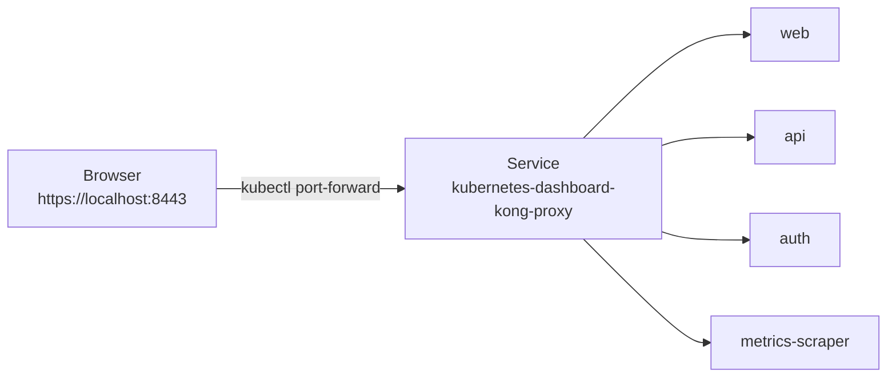
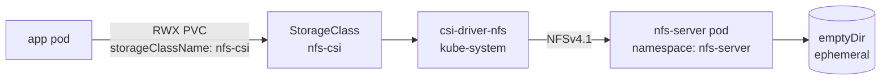
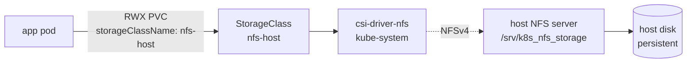
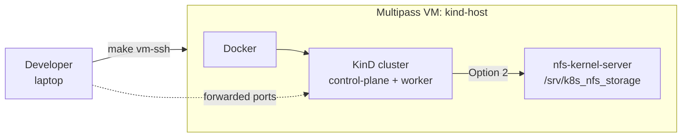

[](https://github.com/AndriyKalashnykov/kind-cluster/actions/workflows/end2end-tests.yml)
[](https://hits.sh/github.com/AndriyKalashnykov/kind-cluster/)
[](https://opensource.org/licenses/MIT)
[](https://app.renovatebot.com/dashboard#github/AndriyKalashnykov/kind-cluster)

# kind-cluster

Local Kubernetes lab on Docker via [KinD](https://kind.sigs.k8s.io/) — ingress, MetalLB, Dashboard, RWX NFS storage, and Prometheus wired up out of the box. Run on your host, or inside a throwaway Multipass VM.

| Component | Technology |
|-----------|-----------|
| Cluster | [KinD](https://kind.sigs.k8s.io/) on Docker |
| Ingress | [ingress-nginx](https://kubernetes.github.io/ingress-nginx/) |
| Load Balancer | [MetalLB](https://metallb.universe.tf/) |
| Storage (RWX) | [csi-driver-nfs](https://github.com/kubernetes-csi/csi-driver-nfs) — same driver for both in-cluster and host-backed NFS |
| Observability | [kube-prometheus-stack](https://github.com/prometheus-community/helm-charts) |
| Dashboard | [Kubernetes Dashboard](https://github.com/kubernetes/dashboard) |
| CI | GitHub Actions (`helm/kind-action`) |

## Quick Start

```bash
make deps        # verify required tools are installed
make kind-up     # create cluster + Nginx ingress + MetalLB + demo workloads
kubectl cluster-info --context kind-kind
echo "127.0.0.1 demo.localdev.me" | sudo tee -a /etc/hosts   # one-time
# Open http://demo.localdev.me/
make kind-down   # tear down
```

`kind-up` is a docker-compose-style alias for `install-all`. For the cluster and add-ons without the demo apps, run `make install-all-no-demo-workloads`.

## Prerequisites

| Tool | Version | Purpose |
|------|---------|---------|
| [GNU Make](https://www.gnu.org/software/make/) | 3.81+ | Task orchestration |
| [Git](https://git-scm.com/) | latest | Version control |
| [Docker](https://www.docker.com/) | latest | Container runtime for KinD nodes |
| [kind](https://kind.sigs.k8s.io/docs/user/quick-start#installation) | v0.31.0+ | Local Kubernetes in Docker |
| [kubectl](https://kubernetes.io/docs/tasks/tools/) | v1.35.0+ | Kubernetes CLI |
| [helm](https://helm.sh/docs/intro/install/) | v3+ | Chart-based installs (dashboard, Prometheus, NFS) |
| [curl](https://curl.se/) | latest | Download helpers used by scripts |
| [jq](https://github.com/jqlang/jq) | latest | JSON parsing in scripts |
| [base64](https://command-not-found.com/base64) | latest | Token decoding for dashboard access |

## Available Make Targets

Run `make help` to list targets.

### Cluster Lifecycle

| Target | Description |
|--------|-------------|
| `make kind-up` | docker-compose-style alias for `install-all` (bring the whole stack up) |
| `make kind-down` | docker-compose-style alias for `delete-cluster` (tear the whole stack down) |
| `make install-all` | Create cluster + Nginx ingress + MetalLB + demo workloads (granular) |
| `make install-all-no-demo-workloads` | Create cluster + Nginx ingress + MetalLB (no demo apps) |
| `make create-cluster` | Create KinD cluster (granular) |
| `make delete-cluster` | Delete KinD cluster (granular) |
| `make export-cert` | Export k8s client keys and CA certificates |

### Cluster Add-ons

| Target | Description |
|--------|-------------|
| `make dashboard-install` | Install Kubernetes Dashboard (Helm chart v7.14.0) + admin ServiceAccount |
| `make dashboard-forward` | Port-forward dashboard to `https://localhost:8443` and open browser |
| `make dashboard-token` | Print the admin-user token |
| `make nginx-ingress` | Install Nginx ingress controller |
| `make metallb` | Install MetalLB load balancer |
| `make metrics-server` | Install metrics-server (for `kubectl top` / HPA) |
| `make kube-prometheus-stack` | Install Prometheus + Grafana + Alertmanager |

### Virtual Ubuntu Host (Multipass)

| Target | Description |
|--------|-------------|
| `make vm-up` | Launch Ubuntu 22.04 VM via Multipass, cloud-init provisions Docker + kind + kubectl + helm + nfs-kernel-server |
| `make vm-ssh` | Open interactive shell inside the VM |
| `make vm-install-all` | Run `make install-all` inside the VM (remote bootstrap) |
| `make vm-down` | Stop, delete, and purge the VM |

### RWX Storage (NFS)

| Target | Description |
|--------|-------------|
| `make nfs-incluster` | Option 1 — in-cluster NFS server + csi-driver-nfs (no host config) |
| `make nfs-host-setup` | Option 2, step 1 — configure HOST as NFS server (sudo, Ubuntu/Debian) |
| `make nfs-host-provisioner NFS_SERVER=<ip>` | Option 2, step 2 — install `nfs-subdir-external-provisioner` pointing at the host |

### Demo Workloads

| Target | Description |
|--------|-------------|
| `make deploy-app-nginx-ingress-localhost` | Deploy httpd with ingress rule at `http://demo.localdev.me/` |
| `make deploy-app-helloweb` | Deploy helloweb sample app |
| `make deploy-app-golang-hello-world-web` | Deploy golang-hello-world-web sample app |
| `make deploy-app-foo-bar-service` | Deploy foo-bar-service sample app |

### Utilities

| Target | Description |
|--------|-------------|
| `make deps` | Verify required tools are installed |
| `make image-build` | Build `kubectl-test` Docker image (from `images/Dockerfile`) |
| `make registry` | Create a KinD cluster wired to a local Docker registry at `localhost:5001` |
| `make registry-test` | Push `hello-app:1.0` to the local registry and deploy it (run after `make registry`) |
| `make renovate-validate` | Validate `renovate.json` configuration |

## k8s Dashboard

Pinned to Helm chart [`kubernetes-dashboard`](https://github.com/kubernetes/dashboard) **v7.14.0**. Dashboard v7 splits the monolithic v2 service into microservices (`api`, `web`, `auth`, `metrics-scraper`) behind a **Kong Gateway** reverse proxy — you port-forward the `kong-proxy` Service, not a pod.



```bash
make dashboard-install   # helm upgrade --install + apply admin ServiceAccount + write token to dashboard-admin-token.txt
make dashboard-forward   # kubectl port-forward svc/kubernetes-dashboard-kong-proxy 8443:443 + xdg-open
make dashboard-token     # print the admin-user token
```

At the login screen, select **Token** and paste the token printed by `make dashboard-token`.

Uninstall: `helm delete kubernetes-dashboard --namespace kubernetes-dashboard`.

## NFS & RWX storage

Kubernetes default storage classes only support `ReadWriteOnce` (a PV can be mounted by a single node). To run workloads that need `ReadWriteMany` (multiple pods writing to the same volume) — e.g., CI shared caches, content-processing pipelines, WordPress clusters — you need an NFS-backed StorageClass.

Two approaches are provided. Pick one.

### Option 1 — in-cluster NFS (recommended for local dev)

An NFS server runs as a pod inside the cluster. [csi-driver-nfs](https://github.com/kubernetes-csi/csi-driver-nfs) provisions PVs backed by that pod. **No host config, no sudo, no `/etc/exports`.** Tears down cleanly with the cluster; data does not survive `make kind-down`.



```bash
make nfs-incluster
kubectl apply -f ./k8s/nfs/pvc-incluster.yaml   # sample RWX PVC
```

Pinned versions: `csi-driver-nfs` v4.13.1. Source: `scripts/kind-add-nfs-incluster.sh`.

### Option 2 — host-side NFS (persistent across cluster recreates)

The **host machine** runs `nfs-kernel-server` and exports a directory; the same `csi-driver-nfs` used by Option 1 provisions PVs backed by that host export. Data survives cluster teardown — useful when you want state to outlive `kind-down`. Requires sudo on the host and only works on Linux.



```bash
# 1. Host-side: install nfs-kernel-server, create export, open firewall (interactive sudo)
make nfs-host-setup

# 2. In-cluster: install csi-driver-nfs + StorageClass pointing at the host (replace NFS_SERVER with your host IP)
make nfs-host-provisioner NFS_SERVER=192.168.1.27
kubectl apply -f ./k8s/nfs/pvc.yaml             # sample RWX PVC
```

Option 1 and Option 2 differ only in backend: `csi-driver-nfs` is installed once, and you pick a StorageClass (`nfs-csi` for in-cluster, `nfs-host` for host-backed). Sources: `scripts/kind-add-nfs-host-setup.sh`, `scripts/kind-add-nfs-host-provisioner.sh`.

**References:** [NFS Server on Ubuntu](https://www.tecmint.com/install-nfs-server-on-ubuntu/) · [Dynamic NFS Provisioning in k8s](https://www.linuxtechi.com/dynamic-nfs-provisioning-kubernetes/) · [RWX in KinD with NFS](https://cloudyuga.guru/hands_on_lab/nfs-kind).

## Run in a VM (Multipass)

For full reproducibility — and to keep Docker, kind, and the host NFS server off your main machine — the whole stack can run inside a throwaway Ubuntu VM. [Multipass](https://multipass.run/) ships the image, and a cloud-init YAML does the bootstrap.



### 1. Install Multipass

| Platform | Install command | Notes |
|----------|-----------------|-------|
| Ubuntu / Debian / other Linux with snap | `sudo snap install multipass` | Uses snap confinement; nested virtualization works on KVM-capable hosts |
| macOS (Apple Silicon / Intel) | `brew install --cask multipass` | Uses `hypervisor.framework` on M1/M2/M3 |
| Windows 10/11 | `winget install Canonical.Multipass` or [direct download](https://multipass.run/download/windows) | Requires Hyper-V (Pro/Enterprise) or VirtualBox |

Verify: `multipass version` should print a version string and the daemon should be reachable (`multipass list` returns a table, even if empty).

Other install methods and troubleshooting: <https://multipass.run/install>.

### 2. Launch the VM

```bash
make vm-up                                # defaults: 4 CPU / 8 GB RAM / 40 GB disk
# or override:
make vm-up CPUS=6 MEMORY=12G DISK=60G NAME=my-kind
```

First boot takes ~3–5 min (Ubuntu cloud image download, apt-get install, docker pull, kind/kubectl/helm fetch). Subsequent `vm-up` on the same `NAME` is a no-op — the command prints `VM already exists` and shows `multipass info`.

The cloud-init playbook (`vm/cloud-init.yaml`) runs once at first boot:

1. Installs Docker CE, KinD v0.31.0, kubectl v1.35.1, helm v3.19.0
2. Installs `nfs-kernel-server`, exports `/srv/k8s_nfs_storage`
3. Clones this repo to `/home/ubuntu/kind-cluster`
4. Writes `/var/lib/kind-cluster-bootstrapped` as the finished sentinel — `vm-up.sh` polls this file.

### 3. Run the stack

```bash
# Option A: interactive — SSH in, then run inside
make vm-ssh
cd ~/kind-cluster && make install-all

# Option B: remote one-shot (git pulls latest + runs install-all)
make vm-install-all
```

### 4. Access services from your host browser

> Commands below are labelled `[HOST]` (your laptop shell) or `[VM]` (after `make vm-ssh`). `multipass` only exists on the host.

MetalLB `LoadBalancer` IPs and the ingress IP live on the VM's internal `kind` docker network (typically `172.18.0.0/16`) and are **not directly routable from your host**. Pick one of the two approaches below.

First, capture the VM name and its IPv4 (you'll reuse both):

```bash
# [HOST]
NAME=${NAME:-kind-host}                                                            # match make vm-up default
VM_IP=$(multipass info "$NAME" --format json | jq -r '.info | to_entries[0].value.ipv4[0]')
echo "NAME=$NAME  VM_IP=$VM_IP"
```

#### Option A — SSH tunnel per service (no sudo, works everywhere)

One tunnel per service. The host URL becomes `http://localhost:<port>`.

`multipass launch` does not inject your host SSH key, so do this once per VM before tunneling:

```bash
# [HOST] — authorize your key in the VM (idempotent; adjust the key path if needed)
PUBKEY=$(cat ~/.ssh/id_ed25519.pub)
multipass exec $NAME -- bash -c "mkdir -p /home/ubuntu/.ssh && grep -qxF '$PUBKEY' /home/ubuntu/.ssh/authorized_keys 2>/dev/null || echo '$PUBKEY' >> /home/ubuntu/.ssh/authorized_keys && chown -R ubuntu:ubuntu /home/ubuntu/.ssh && chmod 700 /home/ubuntu/.ssh && chmod 600 /home/ubuntu/.ssh/authorized_keys"
```

```bash
# [HOST] — discover a LB IP from inside the VM
LB_IP=$(multipass exec $NAME -- kubectl get svc helloweb -o jsonpath='{.status.loadBalancer.ingress[0].ip}')

# [HOST] — tunnel host:8080 → VM → LB_IP:80 (background, -N = no shell)
ssh -fN -L 8080:$LB_IP:80 ubuntu@$VM_IP

# Browser: http://localhost:8080
```

Same pattern for the other demo services — change the `svc/` name and upstream port:

| Service | Upstream port |
|---|---|
| `helloweb` | `80` |
| `golang-hello-world-web-service` | `8080` |
| `foo-service` | `5678` |

Kill tunnels with `pkill -f "ssh.*-L.*$VM_IP"`.

For ingress-based URLs (`http://demo.localdev.me/`), tunnel to the ingress controller's LB IP on port 80 and add `127.0.0.1 demo.localdev.me` to `/etc/hosts`:

```bash
# [HOST]
INGRESS_IP=$(multipass exec $NAME -- kubectl get svc -n ingress-nginx ingress-nginx-controller -o jsonpath='{.status.loadBalancer.ingress[0].ip}')
ssh -fN -L 8080:$INGRESS_IP:80 ubuntu@$VM_IP
echo "127.0.0.1 demo.localdev.me" | sudo tee -a /etc/hosts
# Browser: http://demo.localdev.me:8080/
```

#### Option B — Static route to the kind subnet (Linux/macOS, sudo once, natural URLs)

Route the VM's kind docker subnet through the VM. After this, MetalLB IPs and the ingress IP are reachable directly from the host — the real URLs work in your browser.

```bash
# [HOST] — discover the kind IPv4 subnet (modern Docker lists IPv6 first when dual-stack)
KIND_NET=$(multipass exec $NAME -- bash -lc "docker network inspect kind | jq -r '.[0].IPAM.Config[] | select(.Subnet | test(\"^[0-9]+\\\\.\")) | .Subnet' | head -1")

# [HOST] — Linux
sudo ip route add "$KIND_NET" via "$VM_IP"

# [HOST] — macOS
# sudo route -n add -net "$KIND_NET" "$VM_IP"

# [HOST] — resolve the demo hostname to the ingress IP
INGRESS_IP=$(multipass exec $NAME -- kubectl get svc -n ingress-nginx ingress-nginx-controller -o jsonpath='{.status.loadBalancer.ingress[0].ip}')
echo "$INGRESS_IP demo.localdev.me" | sudo tee -a /etc/hosts

# Browser: http://demo.localdev.me/   (and any LB IP directly)
```

Clean up after `make vm-down`:

```bash
# [HOST]
sudo ip route del "$KIND_NET"                              # Linux
# sudo route -n delete -net "$KIND_NET"                    # macOS
sudo sed -i.bak '/demo\.localdev\.me/d' /etc/hosts
```

Caveat: routes are kernel-wide and collide if another tool uses the same `172.18.0.0/16` subnet on the host (e.g., local Docker Desktop). If so, recreate the VM with a different docker bridge subnet or stick with Option A.

#### Kubernetes Dashboard

The dashboard forwards to `localhost:8443` *inside* the VM. Tunnel it to your host:

```bash
# [HOST] — terminal 1
make vm-ssh

# [VM] — terminal 1
make dashboard-forward                # serves https://localhost:8443 inside the VM

# [HOST] — terminal 2
ssh -fN -L 8443:localhost:8443 ubuntu@$VM_IP
# Browser: https://localhost:8443

# [HOST] — grab the login token
multipass exec $NAME -- bash -lc 'cd ~/kind-cluster && make dashboard-token'
```

Demo endpoints once installed (the `<LB_IP>` values come from the `multipass exec ... kubectl get svc` commands above):

| App | URL from host (after tunnel/route) | Port |
|-----|------------------------------------|------|
| httpd + ingress | `http://demo.localdev.me/` | 80 |
| helloweb | `http://<LB_IP>/` | 80 |
| golang-hello-world-web | `http://<LB_IP>:8080/myhello/` · `/healthz` | 8080 |
| foo-bar-service | `http://<LB_IP>:5678/` | 5678 |
| Kubernetes Dashboard | `https://localhost:8443` (after `make dashboard-forward` + SSH tunnel) | 8443 |

### 5. Tear down

```bash
make vm-down
```

Runs `multipass stop && multipass delete && multipass purge` — no stale VMs left behind.

Override `NAME` to target a specific VM: `make vm-down NAME=my-kind`.

## Observability

### kube-prometheus-stack (Prometheus + Grafana + Alertmanager)

```bash
make kube-prometheus-stack
```

The script installs the community [`kube-prometheus-stack`](https://github.com/prometheus-community/helm-charts/tree/main/charts/kube-prometheus-stack) Helm chart into the `monitoring` namespace, patches the `grafana` Service to `LoadBalancer` (served via MetalLB), and prints the Grafana URL and admin credentials.

| Component | URL | Exposed via | Credentials |
|---|---|---|---|
| Grafana | `http://<LB_IP>/` (printed by the script; discover with `kubectl get svc -n monitoring kube-prometheus-stack-grafana`) | MetalLB LoadBalancer | `admin` / password printed by `make kube-prometheus-stack` (retrieve later with `kubectl get secret -n monitoring kube-prometheus-stack-grafana -o jsonpath='{.data.admin-password}' \| base64 -d`) |
| Prometheus | `http://localhost:9090/` — UI at `/`, scrape targets at `/targets` | `kubectl port-forward` (below) | none |
| Alertmanager | `http://localhost:9093/` | `kubectl port-forward` (below) | none |

```bash
# Prometheus UI
kubectl port-forward -n monitoring svc/kube-prometheus-stack-prometheus 9090:9090
# Alertmanager UI
kubectl port-forward -n monitoring svc/kube-prometheus-stack-alertmanager 9093:9093
```

If you're running inside a Multipass VM, prefix with `multipass exec $NAME --` or run the port-forward inside the VM and add a host-side SSH tunnel exactly like the Dashboard flow in §4 above (replace `8443` with `9090` / `9093`).

### metrics-server

Required for `kubectl top` and HorizontalPodAutoscalers. On KinD, the default manifest is patched with `--kubelet-insecure-tls` (the KinD kubelet serving cert isn't signed by the cluster CA).

```bash
make metrics-server
```

## Local Docker Registry

For pushing locally-built images without going through Docker Hub/GHCR, `make registry` creates a fresh KinD cluster wired to a Docker registry at `localhost:5001` — containerd on the kind nodes mirrors that registry, so pods can pull `localhost:5001/<image>:<tag>` directly.

```bash
make registry         # create cluster + registry container
make registry-test    # pull hello-app, retag to localhost:5001, push, deploy, curl
```

This is an **alternative** to the default `make install-all` flow — the registry cluster doesn't include ingress, MetalLB, or the demo workloads. Useful for iterating on an image you're building locally. Tear down with `make delete-cluster` and remove the registry container with `docker rm -f kind-registry`.

## CI/CD

GitHub Actions runs on every push to `main`, tags `v*`, and pull requests.

| Job | Triggers | Steps |
|-----|----------|-------|
| **test-e2e** | push, PR, tags | Spin up KinD via `helm/kind-action`, install ingress + MetalLB + dashboard, deploy all demo workloads, curl-verify each via `docker exec` into the kind control-plane (~3.5 min end-to-end) |

A separate `cleanup-runs.yml` workflow prunes old workflow runs on a weekly schedule (Sunday midnight).

No repo secrets or variables are required by the workflow — only the default `GITHUB_TOKEN`.

[Renovate](https://docs.renovatebot.com/) keeps action digests, container images, and tool versions pinned in `Makefile` / `scripts/*.sh` (via `# renovate:` inline comments) up to date with platform automerge enabled.
