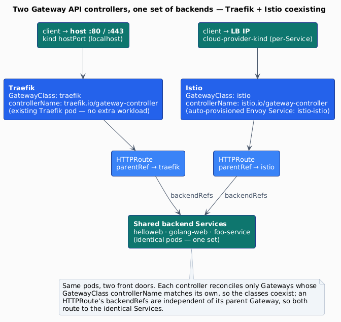

# Gateway API & ingress controllers in this cluster

> How `kind-cluster` exposes HTTP services, why the Kubernetes **Gateway API** is
> the strategic successor to classic **Ingress**, and a fact-checked comparison of
> the headline Gateway API implementations — **Traefik**, **Istio**, and a
> CNI-integrated option (**Cilium** / **Calico**) — plus additional opt-in
> conformant controllers (**NGINX Gateway Fabric**, **Contour**, **Envoy Gateway**,
> **kgateway**, **Kong**) wired as extra GatewayClasses, including how to run more
> than one of them in the same cluster.
>
> Every version, conformance status, and behaviour below is cited to a primary
> source (see [References](#references)). Verified 2026-07-08 against Gateway API
> **v1.6.0**, Traefik chart **41.0.2** (appVersion **v3.7.5**), Istio **1.30.2**,
> NGINX Gateway Fabric **2.6.6**, Contour **v1.33.5**, Envoy Gateway **v1.8.2**,
> kgateway **v2.3.5**, Kong/KIC chart **0.24.0**, Cilium **v1.19.4**, Calico **v3.32.0**.

## TL;DR

- The project's **default** path is still **classic Ingress** (`networking.k8s.io/v1`,
  `ingressClassName: traefik`) — see [`k8s/demo-apps-ingress.yaml`](../k8s/demo-apps-ingress.yaml).
  It is the simplest thing that works and stays the zero-config default.
- The **Gateway API** is the future: the Ingress API is feature-frozen, and the
  reference `ingress-nginx` controller is **retiring** (best-effort maintenance
  ends March 2026) — which is why this project already moved to **Traefik**.
  Gateway API is **GA** (v1.0 in Oct 2023; current **v1.6.0**).
- Traefik v3 and Istio are both **conformant Gateway API controllers**. You can
  enable them here opt-in:
  - `make gateway-traefik` — turns on Traefik's Gateway API provider and routes
    the **same** demo apps through a `Gateway` + `HTTPRoute`s (no extra workload —
    same Traefik pod also keeps serving classic Ingress).
  - `make gateway-istio` — installs Istio (minimal) as a **second** Gateway API
    controller that coexists with Traefik and fronts the **same** demo apps via
    its own LoadBalancer IP.
  - `make gateway-nginx` — installs **NGINX Gateway Fabric** (OSS) as another
    conformant Gateway API controller. Like Istio it provisions a per-Gateway data
    plane with its own LoadBalancer IP, fronting the **same** demo apps. NGF is
    NGINX's Gateway-API-native successor to the retired `ingress-nginx`.
  - `make gateway-contour` — installs **Project Contour** via its **Gateway
    provisioner**; each Gateway gets its own Envoy data plane + LoadBalancer IP,
    fronting the **same** demo apps.
  - `make gateway-envoy` / `make gateway-kgateway` / `make gateway-kong` — three
    more conformant controllers (**Envoy Gateway** and **kgateway** are CNCF;
    **Kong**/KIC binds its GatewayClass to one shared proxy in unmanaged mode),
    each fronting the **same** demo apps on its own LB IP. All seven are detailed
    in the [wiring table](#how-this-project-wires-it).
- **Antrea is not in this comparison.** Antrea is a **CNI**, not a Gateway API
  controller — its "gateway" (`antrea-gw0`) is an Open vSwitch dataplane interface,
  unrelated to `gateway.networking.k8s.io`. If you want a **CNI-integrated**
  gateway, the real options are **Cilium** or **Calico** (both conformant) — see
  [§ CNI-integrated gateways](#cni-integrated-gateways-cilium--calico).

---

## Ingress vs Gateway API

Classic **Ingress** (`networking.k8s.io/v1`) is a single, controller-specific
resource: one object holds host/path rules, and everything beyond plain HTTP
host/path routing (TLS options, header rewrites, traffic splitting, gRPC, TCP)
lives in **controller-specific annotations**. That annotation sprawl, plus a lack
of role separation, is why the Ingress API was frozen and the community built a
replacement.

The **Gateway API** (`gateway.networking.k8s.io`) is a role-oriented, typed
replacement, GA since v1.0:

| Resource | Owned by | Purpose |
|----------|----------|---------|
| **GatewayClass** | infrastructure provider | Names a controller via `controllerName` (like a `StorageClass` for gateways) |
| **Gateway** | cluster operator | A concrete data-plane listener (ports, protocols, TLS) bound to one GatewayClass |
| **HTTPRoute** / GRPCRoute / TCPRoute / TLSRoute | app developer | Routing rules: `parentRefs` (which Gateways) + `backendRefs` (which Services) |

Two properties matter for everything below:

1. **`GatewayClass.spec.controllerName` selects the controller.** Each controller
   *"MUST watch all GatewayClasses, and reconcile GatewayClasses that have a
   matching controllerName"* — and ignores the rest. This is what lets multiple
   controllers coexist (see [§ Running more than one](#running-more-than-one-controller)).
2. **An `HTTPRoute` references a Gateway (`parentRefs`) and Services
   (`backendRefs`) independently.** The same backend Service can be fronted by
   many routes under different Gateways — which is how two controllers route to
   the *same* app.

**Channels.** Gateway API ships a **standard** channel (GA: GatewayClass,
Gateway, HTTPRoute, GRPCRoute, ReferenceGrant, BackendTLSPolicy) and an
**experimental** channel (TCPRoute, TLSRoute, UDPRoute, …). Install one or the
other CRD set:

```bash
# standard (GA) channel
kubectl apply -f https://github.com/kubernetes-sigs/gateway-api/releases/download/v1.6.0/standard-install.yaml
# experimental channel (adds TCPRoute/TLSRoute/UDPRoute)
kubectl apply --server-side -f https://github.com/kubernetes-sigs/gateway-api/releases/download/v1.6.0/experimental-install.yaml
```

> The CRDs are **not** bundled by Traefik's or Istio's charts — they must be
> applied first. The project's `make gateway-*` targets do this for you (pinned,
> Renovate-tracked).

---

## The implementations

All three rows below are **conformant** Gateway API controllers on the official
[implementations registry](https://gateway-api.sigs.k8s.io/implementations/)
(checked 2026-06): Traefik Proxy (v1.5.1), Istio (v1.5.1), Cilium (v1.5.1), Calico (v1.4.1).

| | **Traefik** (this project's default proxy) | **Istio** | **Cilium / Calico** (CNI-integrated) |
|---|---|---|---|
| **What it is** | Standalone L7 reverse proxy / ingress controller | Service mesh + ingress (Envoy data plane) | A **CNI** that *also* implements Gateway API |
| **`controllerName`** | `traefik.io/gateway-controller` | `istio.io/gateway-controller` | `cilium` (GatewayClass) / Calico via Tigera operator |
| **GatewayClass name** | `traefik` (chart can auto-create) | `istio` (built-in; also `istio-remote`, `istio-waypoint`, `istio-east-west`) | `cilium` / a default class from the operator |
| **Deployment model** | In-process provider in the **existing single Traefik pod** — no extra workload | `istiod` control plane **+ one Envoy Deployment+Service auto-provisioned per `Gateway`** (named `<gateway>-<class>`) | Built into the CNI agent/operator (Cilium: built-in Envoy; Calico: Envoy Gateway) |
| **Footprint** | None beyond Traefik (already running) | Heaviest: `istiod` + per-gateway Envoy (sidecar Envoy ≈ 0.2 vCPU / 60 MB at 1k req/s; `istiod` scales with config — Istio docs give no fixed number) | CNI-level; replaces kindnet |
| **Channels** | HTTPRoute, GRPCRoute, BackendTLSPolicy (standard); TCPRoute + **TLSRoute via `experimentalChannel`** | HTTPRoute (standard); experimental routes supported | varies |
| **Install onto a running kind cluster?** | ✅ yes (already installed) | ✅ yes (over the existing CNI — Istio is **not** a CNI) | ❌ no — a CNI is chosen at **cluster creation** (`disableDefaultCNI`), i.e. a cluster recreate |
| **Best for** | Lightweight north-south ingress; the default here | North-south ingress **and** east-west mesh (GAMMA); advanced traffic management | One dataplane for pod networking **and** L7 gateway (eBPF / Envoy) |

### Traefik (Gateway API mode)

Traefik v3 has shipped a production-ready Gateway API provider since v3.1 and is
conformant at Gateway API **v1.5.1**. In this project it is **already running**
as a classic Ingress controller; the Gateway API provider is a second,
independent in-process provider — enabling it does **not** disable Ingress, and
adds **no new pod**. Enable in the Helm chart with:

```bash
--set providers.kubernetesGateway.enabled=true
# optionally: --set providers.kubernetesGateway.experimentalChannel=true   # TCPRoute/TLSRoute
```

The chart can also auto-create a default `traefik` GatewayClass and a default
`Gateway` (`gatewayClass.enabled` / `gateway.enabled`). `make gateway-traefik`
enables the provider and applies the demo `Gateway` + `HTTPRoute`s.

> ⚠️ **`TLSRoute` is an experimental-channel resource.** Traefik v3 supports it,
> but it needs the `experimental-install.yaml` CRDs **and**
> `providers.kubernetesGateway.experimentalChannel=true`. (`HTTPRoute` and
> `GRPCRoute` are standard-channel and need neither.)

### Istio (Gateway API mode)

Istio is a conformant Gateway API controller (`istio.io/gateway-controller`,
GatewayClass `istio`). Key facts for a kind lab:

- **It is not a CNI** — *"ambient mode is not a CNI itself — it runs over existing
  CNIs."* Istio installs onto the running kindnet cluster fine.
- For **north-south ingress only**, you do **not** need to mesh the app pods (no
  sidecar injection, no ambient enrollment). Applying a `Gateway` with
  `gatewayClassName: istio` **auto-provisions** an Envoy `Deployment` + `Service`
  named `<gateway>-istio`; that Service is `LoadBalancer`, so cloud-provider-kind
  gives it its own IP.
- **CRDs must be installed first, and version-compatible** — Istio ≤ 1.29 +
  Gateway API v1.5 CRDs makes `istiod` crash-loop (analyzer check `IST0176`).
  This project pins Istio **1.30.2**, which supports v1.5.x CRDs.
- **GAMMA** (Gateway API for Mesh) extends the same API to **east-west** traffic
  by setting an HTTPRoute's `parentRef` to a **Service** instead of a Gateway —
  out of scope here (we only wire north-south ingress), but it's why Istio is
  more than "another ingress."

`make gateway-istio` installs the Gateway API CRDs + Istio (minimal, via the
official Helm charts — `base` + `istiod`, no app meshing), then applies an Istio
`Gateway` + `HTTPRoute`s for the same demo apps.

### CNI-integrated gateways (Cilium / Calico)

If the interest is a **single dataplane that does both pod networking and L7
gateway**, the real options are **Cilium** and **Calico** — both on the Gateway
API conformance list:

- **Cilium** — eBPF CNI with built-in Gateway API (GatewayClass `cilium`), served
  by an embedded **Envoy**; requires kube-proxy replacement and an LB/L2 path.
- **Calico** — its **Calico Ingress Gateway** is a hardened distribution of the
  **Envoy Gateway** project — enabled cluster-wide via the Tigera operator's
  `GatewayAPI` installation CR, then provisioned per-gateway from a standard
  `Gateway` resource.

**These cannot be "added" to the running cluster.** A cluster has exactly one
CNI, and kind installs `kindnetd` by default; switching CNIs is a
**cluster-creation-time** decision. To try Cilium here you recreate the cluster
with the default CNI disabled:

```yaml
# kind config — disable kindnet so a real CNI can own pod networking
networking:
  disableDefaultCNI: true
  podSubnet: "10.244.0.0/16"
```

```bash
kind create cluster --config kind-cilium.yaml
cilium install --version 1.19.4 --set kubeProxyReplacement=true \
  --set gatewayAPI.enabled=true        # requires Gateway API CRDs pre-applied
```

This is a different (heavier) experiment than the Traefik-vs-Istio comparison,
which is why this repo documents it rather than wiring it into `install-all`. The
kind docs note `disableDefaultCNI` is *"a power user feature with limited
support, but many common CNI manifests are known to work, e.g. Calico."*

### Why not Antrea?

A common confusion worth stating plainly: **Antrea is a CNI, not a Gateway API
controller.** It is **not** on the Gateway API implementations list; the
`antrea-io/antrea` repo has no `sigs.k8s.io/gateway-api` dependency and no
`GatewayClass`/`HTTPRoute` controller. The thing called the **"Antrea gateway"**
is `antrea-gw0` — *"an internal port … to be the gateway of the Node's subnet"* —
an **Open vSwitch dataplane interface** for pod/node traffic, entirely unrelated
to `gateway.networking.k8s.io`. Antrea's L7 features (L7 NetworkPolicy — which is
**Suricata**-based, not Envoy; AntreaProxy; Egress) are east-west CNI features,
not a north-south HTTP gateway. If you saw "Antrea gateway" and expected the
Kubernetes Gateway API, that's the lexical trap. For a **CNI-integrated gateway**
use Cilium or Calico; for a fair **CNI/NetworkPolicy** comparison, Antrea belongs
next to Cilium/Calico/kindnet — a different axis than this document.

---

## Running more than one controller

> *Can Traefik + Istio coexist and route to the **same** apps? Yes. Is it
> advisable? For a comparison lab, yes — with the caveats below.*

**1. No API-level conflict.** Each controller reconciles only Gateways whose
GatewayClass `controllerName` matches its own. `traefik.io/gateway-controller`
and `istio.io/gateway-controller` are distinct, so the `traefik` and `istio`
GatewayClasses coexist and each controller ignores the other's Gateways.

**2. Same app, two front doors.** An `HTTPRoute` names its Gateway in
`parentRefs` and its Services in `backendRefs`; nothing ties a Service to one
route. So an `HTTPRoute` parented to the Traefik Gateway and one parented to the
Istio Gateway can both carry `backendRefs: helloweb` — both gateways front the
identical pods.

**3. The only real contention is the entry-point address:**

- **hostPort 80/443 is single-binding.** Traefik already occupies the
  control-plane node's host ports 80/443 (via `kind-config.yaml`
  `extraPortMappings`). A second controller **cannot** also bind them.
- **cloud-provider-kind gives each `LoadBalancer` Service its own IP** from the
  kind docker bridge (one `kindccm-…` Envoy container per Service). So Istio's
  auto-provisioned gateway Service gets a **distinct** IP.

So you reach **Traefik** at `http://localhost/` (hostPort) and **Istio** at its
own `http://<istio-LB-IP>/` — same backends, different doors. No collision.



_Source: [`docs/diagrams/gateway-coexistence.puml`](diagrams/gateway-coexistence.puml) — rendered by `make diagrams`._

### Is it advisable to install all of them?

- **Traefik + Istio + NGINX Gateway Fabric + Contour + Envoy Gateway + kgateway +
  Kong (Gateway API):** ✅ fine for a comparison lab — each has a distinct
  GatewayClass `controllerName` and its own entry address, all fronting the same
  backends (verified together by `gateway-test.yml`). They use LoadBalancer
  Services (not hostPort), so only Traefik holds host ports 80/443 and the others
  coexist on their own cloud-provider-kind IPs. Istio/NGF/Contour/Envoy
  Gateway/kgateway each provision a **per-Gateway** data plane; Kong (KIC) uses
  the **unmanaged** model (one shared proxy Service). Each adds real weight, so
  all are opt-in, not part of `install-all`. All seven vendor a Gateway API
  client **≥ v1.2.0**, so they share the experimental-channel v1.6.0 CRDs without
  the `supportedFeatures` crash that dropped HAProxy.
- **A "CNI gateway" (Antrea):** ❌ not a thing — Antrea is a CNI (see above).
- **Cilium/Calico (CNI gateway):** ⚠️ a **separate cluster** — a CNI is chosen at
  creation time and is mutually exclusive with kindnet (and with each other). You
  don't run it *alongside*; you recreate the cluster with it.

---

## How this project wires it

| Target | What it does | Reach it at |
|--------|--------------|-------------|
| `make ingress-traefik` | **Default.** Traefik as a classic Ingress controller (`ingressClassName: traefik`), hostPort 80/443 | `http://<app>.localdev.me/` via `localhost` |
| `make ingress-haproxy` | Opt-in. HAProxy (haproxytech `kubernetes-ingress`, chart `1.52.1`) as an alternative classic Ingress controller (`ingressClassName: haproxy`) on its own LB IP, fronting the same demo apps. Immune to the GW API floor (a classic Ingress controller never watches `GatewayClass`). | `curl -H 'Host: helloweb.localdev.me' http://<haproxy-LB-IP>/` |
| `make ingress-nginx` | Opt-in. NGINX Inc. (`nginxinc/kubernetes-ingress`, F5 OSS, chart `2.6.1` — distinct from the retired community `ingress-nginx`) as an alternative classic Ingress controller (`ingressClassName: nginx`) on its own LB IP. `IngressClass nginx` ≠ NGF's `GatewayClass nginx` (different API objects). | `curl -H 'Host: helloweb.localdev.me' http://<nginx-LB-IP>/` |
| `make gateway-traefik` | Opt-in. Installs Gateway API CRDs (pinned), enables Traefik's Gateway API provider, applies a `Gateway` + `HTTPRoute`s for the demo apps on `*.gw.localdev.me` | `curl -H 'Host: helloweb.gw.localdev.me' http://localhost/` (same Traefik hostPort, now also via Gateway API) |
| `make gateway-istio` | Opt-in. Installs Gateway API CRDs + Istio (minimal) + an Istio `Gateway` + `HTTPRoute`s for the **same** demo apps on the original `*.localdev.me` hosts | `curl -H 'Host: helloweb.localdev.me' http://<istio-gateway-LB-IP>/` |
| `make gateway-nginx` | Opt-in. Installs Gateway API CRDs + NGINX Gateway Fabric (OSS, chart `2.6.6`, GatewayClass `nginx`) + a `Gateway` + `HTTPRoute`s for the **same** demo apps on the original `*.localdev.me` hosts. Provisions a per-Gateway `ngf-nginx` data-plane Service with its own LB IP | `curl -H 'Host: helloweb.localdev.me' http://<ngf-gateway-LB-IP>/` |
| `make gateway-contour` | Opt-in. Installs Project Contour (Gateway provisioner, `v1.33.5`, GatewayClass `contour`) + a `Gateway` + `HTTPRoute`s for the **same** demo apps. Provisions a per-Gateway `envoy-contour` Service with its own LB IP. The bundled Gateway API CRDs are stripped so the shared experimental-channel CRDs aren't clobbered. On the cluster's v1.6.0 CRDs the GatewayClass reports `SupportedVersion=False` but still routes correctly (best-effort reconcile — Gateway Programmed, routes Accepted) | `curl -H 'Host: helloweb.localdev.me' http://<contour-gateway-LB-IP>/` |
| `make gateway-envoy` | Opt-in. Installs Envoy Gateway (CNCF, chart `v1.8.2`, GatewayClass `envoy`) + a `Gateway` (`eg`) + `HTTPRoute`s for the **same** demo apps. Reuses the shared GW API CRDs (`crds.gatewayAPI.enabled=false` + `--skip-crds`) and installs only its own `gateway.envoyproxy.io` CRDs. Provisions a per-Gateway Envoy Service in `envoy-gateway-system` with a **generated** name (discovered by `gateway.envoyproxy.io/owning-gateway-*` labels) and its own LB IP. Vendors Gateway API v1.5.1 exactly | `curl -H 'Host: helloweb.localdev.me' http://<envoy-gateway-LB-IP>/` |
| `make gateway-kgateway` | Opt-in. Installs kgateway (CNCF, formerly Gloo OSS, `v2.3.5`, GatewayClass `kgateway`) + a `Gateway` (`kgw`) + `HTTPRoute`s for the **same** demo apps. Its CRD chart ships only `gateway.kgateway.dev` CRDs (never touches the shared GW API CRDs). Provisions a per-Gateway `kgw` Envoy Service with its own LB IP. Vendors Gateway API v1.5.1 exactly | `curl -H 'Host: helloweb.localdev.me' http://<kgateway-LB-IP>/` |
| `make gateway-kong` | Opt-in. Installs Kong Ingress Controller (umbrella chart `kong/ingress` `0.24.0`, DB-less, GatewayClass `kong`) + a `Gateway` (`kong`) + `HTTPRoute`s for the **same** demo apps. **Unmanaged-Gateway model**: rather than a per-Gateway data plane, the GatewayClass is bound (via `konghq.com/gatewayclass-unmanaged: "true"`) to the chart's single Kong proxy `LoadBalancer` Service — so Kong's Gateway API listeners AND its classic Ingress (`ingressClassName: kong`) share one LB IP. KIC vendors Gateway API v1.3.0 (≥ the v1.2.0 floor) | `curl -H 'Host: helloweb.localdev.me' http://<kong-proxy-LB-IP>/` |

All `gateway-*` targets are idempotent on the shared Gateway API CRDs
(install-if-absent), require **cloud-provider-kind** to be running (for LB IPs),
and route to the **existing** demo Services — so you can enable either or both on
a cluster brought up with `make install-all` and compare them side by side.
Smoke coverage for the Gateway API paths is gated behind `TEST_GATEWAY_API=yes`
(see [`scripts/e2e-smoke.sh`](../scripts/e2e-smoke.sh)).

> **The shared CRDs are the experimental channel.** `kind-add-gateway-api-crds.sh`
> installs the **experimental** channel (a strict superset of standard) because
> Project Contour's controller hard-requires `TLSRoute@v1alpha2` at startup — a
> resource served only by the experimental channel. Traefik, Istio, NGINX
> Gateway Fabric, Envoy Gateway and kgateway use only the v1 GA resources, which
> are identical across channels, so the superset satisfies every controller. The
> CRDs are applied with `kubectl apply --server-side` (the experimental
> `httproutes` schema exceeds the 256 KiB client-side `last-applied-configuration`
> annotation limit).
>
> **The compatibility floor is "vendors Gateway API ≥ v1.2.0", not v1.5.**
> `GatewayClass.status.supportedFeatures` changed from a list of strings
> (`[]string`) to a list of objects (`[]{name}`) in Gateway API **v1.2.0**
> ([PR #3200](https://github.com/kubernetes-sigs/gateway-api/pull/3200)); v1.4
> only graduated the field to the standard channel and v1.5 did not re-change its
> type. So any controller whose vendored `sigs.k8s.io/gateway-api` is **≥ v1.2.0**
> deserializes the field natively and coexists on these v1.6.0 CRDs. The six wired
> controllers all clear it (Traefik/Istio/NGF/Envoy Gateway/kgateway vendor
> v1.5.x; Kong/KIC vendors v1.3.0).
>
> **HAProxy Ingress was evaluated and dropped.** Its current stable release
> (`v0.16.1`) vendors a **pre-v1.2.0** Gateway API client where
> `GatewayClassStatus.supportedFeatures` is still `[]string`, so once a sibling
> controller populates the field in the v1.6.0 `[]object` form its GatewayClass
> informer fails to unmarshal and the controller crash-loops (never becomes
> ready). This is independent of channel (the field is structured in standard
> too). Compatibility only returns in the `v0.17.0-alpha` prerelease line; pinning
> a demo lab to an alpha was not worth it, so HAProxy is not wired as a Gateway
> API controller here. (Note: this is the *Gateway API mode* of
> `jcmoraisjr/haproxy-ingress`. The official `haproxytech/kubernetes-ingress` as a
> **classic Ingress** controller is immune — it never watches `GatewayClass`, just
> logs one warning about the unrecognised GW API CRD version and serves Ingress
> normally — and **is** wired here, via `make ingress-haproxy`.)

---

## HTTPS with a locally-trusted CA

Every front door — the Traefik classic Ingress **and** its Gateway-API provider,
all 6 opt-in Gateway API controllers, and both alternative classic ingresses
(all 10) — can serve **trusted** HTTPS, validated with no `-k`, **fully
offline**: no Let's Encrypt, no public domain, no secrets. Opt-in via
`make cert-manager` then `make tls` / `make tls-all`. (Both of Traefik's paths
share the one pod's `:443` and are wired together by `make tls` — see the
entrypoint-port detail in the scope note below.)

**Why not the usual ACME path.** A local cluster's LoadBalancer IPs are on the
`kind` Docker bridge (`172.18.0.0/16`) — not routable from the internet — so
Let's Encrypt **HTTP-01** can't reach them, and **DNS-01** needs a real owned
domain + provider token. So this lab uses a **local self-signed CA** instead:
offline, no secrets, and you trust the CA cert yourself.

**The chain (`make cert-manager`).** cert-manager **v1.20.3** is installed via
its OCI Helm chart with **`config.enableGatewayAPI=true`** — the current flag
(*"since cert-manager 1.15, Gateway API support is no longer gated behind a
feature flag"*; the old `--feature-gates=ExperimentalGatewayAPISupport` is
removed). It then applies `k8s/tls/ca-bootstrap.yaml`:

```text
selfsigned-issuer (selfSigned ClusterIssuer)
   └─> lab-root-ca (Certificate, isCA) -> Secret lab-root-ca (cert-manager ns)
          └─> local-ca (CA ClusterIssuer) — signs every leaf cert
```

The CA cert is exported to `lab-ca.crt` (gitignored). Trust it per-request
(`curl --cacert lab-ca.crt …`) or system-wide
(`sudo cp lab-ca.crt /usr/local/share/ca-certificates/ && sudo update-ca-certificates`).

**DNS via sslip.io.** `sslip.io` returns the IP embedded in a hostname:
`helloweb.172-18-0-6.sslip.io` → `172.18.0.6`, and the wildcard
`*.172-18-0-6.sslip.io` matches every single-label prefix — so each gateway's
runtime LoadBalancer IP gets resolvable HTTPS names with **zero record
management**. The default Traefik path keeps the existing `*.localdev.me` →
`127.0.0.1`.

**Wiring, and the one constraint.** The leaf cert's Secret **must live in the
same namespace as the Ingress/Gateway** that references it (the Gateway API
spec default, and cert-manager's shim limit) — uniform across all controllers,
no per-controller special-casing. The runtime LB IP is the only twist:

| Target | Mechanism | Command |
|--------|-----------|---------|
| Default Traefik — classic Ingress (`*.localdev.me`) **and** Gateway-API provider (`*.gw.localdev.me`) | one `*.localdev.me` + `*.gw.localdev.me` wildcard cert → `Ingress.spec.tls` **and** a Gateway `HTTPS` listener on the `websecure` entrypoint (container port **8443**, `tls.mode: Terminate`, `certificateRefs`). Both terminate on the one shared pod's `:443` and coexist via per-SNI cert resolution. | `make tls` |
| Each Gateway API controller (Istio, NGF, Contour, Envoy Gateway, kgateway, Kong) | read the LB IP → `*.<dashed-ip>.sslip.io` cert (+ IP-SAN) → `HTTPS` listener (`tls.mode: Terminate`, `certificateRefs`) → per-app `helloweb.<ip>.sslip.io` HTTPRoutes | `make tls-all` |
| Each alternative classic Ingress controller (HAProxy, NGINX-Inc) | read the LB IP → `*.<dashed-ip>.sslip.io` cert (+ IP-SAN) → a per-class `Ingress` with `spec.tls` + per-app `helloweb.<ip>.sslip.io` host rules | `make tls-all` |

Certificate fields used: `dnsNames` (wildcard sslip.io / `*.localdev.me` /
`*.gw.localdev.me`) and `ipAddresses` (the LB IP as an IP-SAN). Both are signed
by `local-ca` with no ACME wildcard limit (it's a private CA). Smoke coverage:
`TEST_TLS=yes make e2e-smoke` asserts the static `*.localdev.me` path, the
Traefik Gateway `*.gw.localdev.me` path, and each gateway's sslip.io path with
`--cacert` (no `-k`).

> **Scope note — both Traefik front doors share one entrypoint (the
> entrypoint-port detail).** `make tls` wires trusted HTTPS onto **both** of
> Traefik's paths on the single shared pod: the **classic Ingress**
> (`*.localdev.me`, via `Ingress.spec.tls`) **and** the **Gateway-API provider**
> (`*.gw.localdev.me`, via a Gateway `HTTPS` listener). The one non-obvious
> detail is the **listener port**: Traefik's `kubernetesGateway` provider matches
> a listener to an entrypoint by the entrypoint's **container** port, not the
> host port. `kind-add-traefik.sh` exposes `web` on container port **8000**
> (hostPort 80) and `websecure` on container port **8443** (hostPort 443) — so
> the HTTP listener uses `port: 8000` and the HTTPS listener must use
> `port: 8443` (not `443`). Using `443` is what produces
> `Gateway Not Accepted: … no matching entryPoint for port 443` — there simply is
> no entrypoint on container port 443. The entrypoint's
> `--entryPoints.websecure.http.tls=true` is a **per-router-overridable default**
> (Traefik docs: *"The TLS options can be overridden per router"*), so the
> classic-Ingress TLS routers and the Gateway HTTPS listener coexist on the one
> `websecure` entrypoint, each presenting its own cert by SNI (`*.localdev.me`
> vs `*.gw.localdev.me`, both SANs on the single `lab-localdev-tls` cert).
> Verified live 2026-06-15 — `port: 8443` against chart 40.3.0 / Traefik v3.7.4,
> with both `https://helloweb.localdev.me/` and `https://helloweb.gw.localdev.me/`
> trusted (no `-k`) simultaneously. Hence **all 10 front doors** get trusted
> HTTPS: both Traefik paths via `make tls`, the other 6 Gateway API controllers
> and both alternative classic ingresses (HAProxy, NGINX-Inc) via `make tls-all`.

cert-manager / sslip.io references:
- cert-manager Gateway API usage — <https://cert-manager.io/docs/usage/gateway/>
- cert-manager self-signed / CA issuers — <https://cert-manager.io/docs/configuration/selfsigned/> · <https://cert-manager.io/docs/configuration/ca/>
- Gateway API TLS guide — <https://gateway-api.sigs.k8s.io/guides/tls/>
- sslip.io — <https://sslip.io>

---

## References

Gateway API
- Implementations registry — <https://gateway-api.sigs.k8s.io/implementations/>
- GatewayClass / HTTPRoute references — <https://gateway-api.sigs.k8s.io/reference/api-types/gatewayclass/> · <https://gateway-api.sigs.k8s.io/reference/api-types/httproute/>
- Implementer's Guide (controllerName reconcile rule) — <https://gateway-api.sigs.k8s.io/guides/implementers/>
- Kubernetes concept — <https://kubernetes.io/docs/concepts/services-networking/gateway/>
- Releases (v1.6.0) — <https://github.com/kubernetes-sigs/gateway-api/releases>

Traefik
- Gateway API routing reference — <https://doc.traefik.io/traefik/reference/routing-configuration/kubernetes/gateway-api/>
- Enable the provider / install CRDs — <https://doc.traefik.io/traefik/reference/install-configuration/providers/kubernetes/kubernetes-gateway/>
- Helm chart values — <https://github.com/traefik/traefik-helm-chart/blob/master/traefik/values.yaml>

Istio
- Kubernetes Gateway API task — <https://istio.io/latest/docs/tasks/traffic-management/ingress/gateway-api/>
- Getting started with Gateway API (controllerName) — <https://istio.io/latest/blog/2022/getting-started-gtwapi/>
- GAMMA / mesh — <https://gateway-api.sigs.k8s.io/mesh/> · <https://istio.io/latest/blog/2024/gateway-mesh-ga/>
- Performance & scalability — <https://istio.io/latest/docs/ops/deployment/performance-and-scalability/>

CNI-integrated gateways
- Cilium Gateway API — <https://docs.cilium.io/en/stable/network/servicemesh/gateway-api/gateway-api/>
- Calico Gateway API — <https://docs.tigera.io/calico/latest/networking/gateway-api>

Antrea (why it's not a Gateway API controller)
- Architecture / the `antrea-gw0` gateway port — <https://antrea.io/docs/main/docs/design/architecture/>
- L7 NetworkPolicy (Suricata-based) — <https://antrea.io/docs/main/docs/antrea-l7-network-policy/>
- Antrea on kind (CNI swap) — <https://antrea.io/docs/main/docs/kind/>

kind / LoadBalancer
- LoadBalancer (cloud-provider-kind) — <https://kind.sigs.k8s.io/docs/user/loadbalancer/>
- Configuration (`disableDefaultCNI`, `extraPortMappings`) — <https://kind.sigs.k8s.io/docs/user/configuration/>
- cloud-provider-kind — <https://github.com/kubernetes-sigs/cloud-provider-kind>
